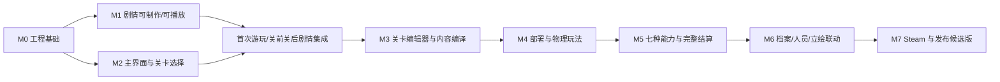

# Unity 2D 建造解谜游戏——双人开发计划

> 依据文档：《Unity2D建造解谜游戏-完整技术设计文档.md》  
> 计划起点：2026-08-15  
> 目标：2027 年 2 月底形成发布候选版，2027 年 3 月作为审核、修复和上线缓冲  
> 人力：程序 A、程序 B；每人每天约 2 小时，每周 7 天  
> 节奏：每 3 天一个验收周期，每周期约 12 人时  
> 范围：只安排程序工作；美术、音频、正式文本和正式关卡内容并行提供，程序阶段可使用占位资源

---

## 1. 计划目标与原则

### 1.1 交付目标

完整版本包含：

- Bootstrap、场景流转和通用服务；
- 开始界面、设置、本地化、音频；
- 剧情运行系统及 Unity 剧情编辑器；
- 主界面壳、地图与关卡选择；
- 官方关卡编辑器、内容编译器和校验器；
- 部署、固定 Tick 物理模拟、胜负判定和结算；
- 7 种能力框：加速、反重力、隐藏/显示障碍物、改变重力方向、缩小、回溯、传送门；
- 统一进度与解锁；
- 档案页面、人员页面和剧情立绘联动；
- 单一玩家自动存档、迁移、备份；
- Steam 启动、成就、统计、显式云存档同步；
- 排行榜与创意工坊只保留接口，不实现首发功能；
- 测试、内容门禁、物理回归和 Windows/Steam 发布构建。

### 1.2 优先顺序

按已确认需求，开发顺序为：

```text
工程基础
→ 剧情系统与剧情编辑器
→ 主界面壳与关卡选择
→ 官方关卡数据/编辑器
→ 关卡部署与物理玩法
→ 进度、结算和存档完善
→ 档案与人员页面
→ 人员当前形象影响剧情默认立绘
→ Steam、硬化与发布
```

剧情和关卡选择相对独立，第一阶段由两人并行开发。关卡选择先使用测试 LevelSummary 数据，不等待完整 Gameplay。

### 1.3 不从 Demo 继承架构

正式项目按新技术设计从零搭建：

- 不延续 CSV 内容/存档结构；
- 不以 Demo 的信息校验为正式实现；
- Demo 只作为 UI、能力框交互、小车和物理表现的参考；
- 迁移 Demo 代码不列为独立工作包，开发者只有在确认依赖清晰、行为可测试时才复制局部实现。

---

## 2. 三日周期工作规范

### 2.1 每周期容量

```text
程序 A：约 6 小时
程序 B：约 6 小时
合计：约 12 人时
```

每人每周期只承担一个主要产出，避免在 6 小时内跨两个大型模块。研究性任务必须产出可执行结果，例如测试 Scene、技术结论和保留/否决决定，不能只写“研究完成”。

### 2.2 最低验收标准

每个三日周期不要求形成完整游戏画面，但至少满足：

1. 项目可编译，主分支没有新增阻断性错误；
2. 该周期承诺的接口、模块或功能已经可以被调用；
3. 至少存在一个功能演示、EditMode 测试、PlayMode 测试或 Editor 操作路径；
4. 失败路径有最基本的 Result/日志，不静默吞掉；
5. 另一名程序完成一次短代码审阅或接口确认；
6. 未完成项明确顺延，不用空实现冒充完成。

### 2.3 周期结束记录模板

```text
周期编号：Cxx
本周期目标：
程序 A 完成：
程序 B 完成：
接口变化：
演示/测试入口：
遗留问题：
下周期调整：
```

### 2.4 分工原则

- 程序 A 初始主责：应用流程、剧情、uGUI、Meta 页面、档案与人员。
- 程序 B 初始主责：内容数据、存档、关卡运行、Physics2D、Steam。
- 公共 Contracts 由需求方先提出，另一人审阅后再合入。
- 每 2 个周期至少做一次端到端集成，不允许两个分支持续分离超过 6 天。
- 模块主责不等于永久独占；复杂能力和发布阶段需要交叉审阅。

---

## 3. 依赖关系与里程碑



| 里程碑 | 周期 | 目标日期 | 通过标准 |
|---|---:|---:|---|
| M0 工程骨架 | C01-C05 | 2026-08-29 | Bootstrap、Contracts、内容、基础存档可运行 |
| M1/M2 剧情与关卡选择 | C06-C18 | 2026-10-07 | 可制作并播放分支剧情；可浏览地图和进入占位关卡 |
| M3/M4 关卡编辑与核心玩法 | C19-C32 | 2026-11-18 | 编辑器可产出关卡；部署、模拟、失败恢复可运行 |
| M5 七种能力与结算 | C33-C44 | 2026-12-24 | 7 种能力完成；可从选关到通关并保存最佳成绩 |
| M6 局外与平台 | C45-C56 | 2027-01-29 | 档案、人员、形象联动、Steam 与云档完成 |
| M7 发布候选 | C57-C63 | 2027-02-19 | 内容门禁、回归、性能和 Steam 构建通过 |
| 缓冲 | C64-C66 | 2027-02-28 | 修复阻断问题，形成 RC 或顺延依据 |

---

## 4. 第一阶段：工程基础（C01-C05）

### C01：工程与程序集骨架（2026-08-15～08-17）

**程序 A**

- 创建 `00_Bootstrap`、`01_StartMenu`、`02_MetaHub`、`03_Story`、`04_Gameplay` 场景占位；
- 建立 `Game.Foundation`、`Game.Contracts`、`Game.Flow`、`Game.Presentation` asmdef；
- 建立基本目录、命名空间和程序集依赖检查。

**程序 B**

- 建立 `Game.Content`、`Game.Persistence`、`Game.Platform`、`Game.Progression`、`Game.Story`、`Game.Meta`、`Game.Gameplay` asmdef；
- 安装并锁定 Input System、Localization、Test Framework、Newtonsoft Json、Steamworks.NET；
- 创建第三方依赖与许可证登记文件。

**新增接口/类型**

- `Result`、`Result<T>`；
- 强类型 ID 基类/模板：`LevelId`、`StoryId`、`CharacterId`、`ArchiveEntryId`；
- `ErrorCode`、`ErrorCategory`。

**验收**

- 所有空程序集能编译；
- Runtime 程序集不能引用 UnityEditor；
- Bootstrap Scene 能进入空 StartMenu Scene。

### C02：Bootstrap、场景流转与事件边界（2026-08-18～08-20）

**程序 A**

- 实现 `IGameFlowService` 第一版；
- 实现功能 Scene 的 Additive Load、SetActive、Unload；
- 加载期间屏蔽重复导航请求。

**程序 B**

- 实现 `IDomainEventBus`；
- 实现 `IClock`、基础日志上下文和 `CancellationToken` 生命周期；
- 编写事件订阅释放测试。

**新增接口**

```text
IGameFlowService
IDomainEventBus
IClock
ISceneLoader（Flow 内部接口）
```

**验收**

- StartMenu、MetaHub、Story、Gameplay 占位场景可往返切换；
- 重复点击不会加载两份 Scene；
- 卸载 Scene 后订阅和异步请求被取消。

### C03：开始界面、设置骨架与本地文件写入（2026-08-21～08-23）

**程序 A**

- 实现 StartMenu View/Presenter；
- 完成开始/继续、设置、退出三个按钮的占位流程；
- 建立 GlobalOverlayCanvas 和 ModalCanvas。

**程序 B**

- 定义 `SettingsSave`、`ProfileSave` V1；
- 实现 JSON `.tmp -> .json -> .bak` 原子写入；
- 实现 `ISaveRepository` 的设置加载/保存最小版本。

**新增接口**

```text
ISettingsService
ISaveRepository
IAtomicFileWriter（Persistence 内部）
IView<TViewModel>
```

**验收**

- 修改占位音量/语言后重启仍能读取；
- 故意破坏 settings.json 后可从备份或默认值恢复；
- StartMenu 三个主操作都有功能反馈。

### C04：本地化、音频和官方内容入口（2026-08-24～08-26）

**程序 A**

- 实现 `ILocalizationService`、默认 `zh-CN` Locale 和 UI 文本刷新；
- 实现 `IAudioService` 和 Master/Music/SFX Mixer 参数；
- 设置弹窗可以真正应用三类音量、分辨率、全屏、语言。

**程序 B**

- 定义 `ContentHeader`、`OfficialContentCatalog`、资源 Registry；
- 实现 `IContentProvider`、`IContentService`、`IAssetResolver` 最小版本；
- 使用 1 个测试 LevelSummary、1 个测试 StoryDefinition 验证读取。

**新增接口**

```text
ILocalizationService
IAudioService
IContentProvider
IContentService
IAssetResolver
```

**验收**

- 切换 Locale 后当前页面立即刷新；
- 音量设置实际影响 AudioMixer；
- 运行时可以通过稳定 ID 读取测试内容和资源，不使用 `Resources.Load` 字符串。

### C05：单一玩家档案与主界面壳（2026-08-27～08-29）

**程序 A**

- 实现 MetaHubShell：上栏、下栏、侧栏和页面容器；
- 实现 Map/Archive/Character/Lounge 页面路由；
- Lounge 使用“暂未开放”占位实现。

**程序 B**

- 完成 `ProfileSave` V1、本地 Load/Save、Revision 和迁移器框架；
- 实现首次昵称创建与已有档继续判断；
- 建立 `IProgressQuery` 的内存空实现。

**新增接口**

```text
IProgressQuery
IMetaPageRouter（Presentation 内部）
ISaveMigrator<T>
```

**验收**

- 首次开始要求昵称并生成单一档案；
- 再次启动直接继续；
- MetaHub 四个入口可切换，最后页面可恢复。

---

## 5. 第二阶段：剧情与关卡选择并行（C06-C18）

### C06：剧情/地图数据契约

**程序 A：剧情线**

- 定义 `StoryDefinition`、StoryNodeId 和 Dialogue/Choice/Goto/End 节点 DTO；
- 定义节点引用和本地化 Key 规则；
- 完成基础 StoryDefinition Validator。

**程序 B：地图线**

- 定义 `MapDefinition`、`LevelSummary`、`UnlockRequirementData`；
- 准备 6～7 张测试地图和 30 个测试关卡节点数据；
- 实现关卡/地图稳定 ID 校验。

**验收**

- 一段含分支并汇合的测试剧情能通过数据校验；
- 30 个测试节点能通过 ContentService 查询和排序。

### C07：StoryRunner 与进度只读模型

**程序 A**

- 实现 `IStoryService.Start/Advance/Choose`；
- 实现 Dialogue、Goto、End 执行；
- 非法 NextNodeId 返回内容错误。

**程序 B**

- 定义 `ProgressSnapshot`、`LevelProgressView`、完成事实集合；
- 完成 `IProgressQuery` 基本查询；
- ProfileSave 与 ProgressSnapshot 映射。

**验收**

- 无 UI 条件下可以逐节点跑完线性剧情；
- 重启后完成关卡/剧情事实仍可被查询。

### C08：剧情分支与 MetaHub 公共 UI

**程序 A**

- 完成 Choice 分支、选项校验、Goto 汇合；
- 选择结果只保存在 StorySession，不写 Profile；
- 增加剧情循环保护和最大执行步数。

**程序 B**

- 完成驾驶舱上栏、下栏、侧栏数据绑定；
- 显示昵称、当前页面、章节占位、真实本地时间；
- Hero 导航通过 Presenter 切页。

**验收**

- 两条分支都能汇合并结束；
- MetaHub 公共 UI 不依赖具体页面实现即可运行。

### C09：Story Scene 表现端口与地图查询

**程序 A**

- 实现 `IStoryPresentationPort`；
- 完成说话人、正文、继续、选项的基础 uGUI；
- 点击屏幕和空格都能推进。

**程序 B**

- 实现 `IMetaMapQuery`；
- 合并 Content 与 Progress，生成 MapTab/LevelNode ViewModel；
- 完成已解锁、当前、已完成节点状态。

**新增接口**

```text
IStoryPresentationPort
IMetaMapQuery
```

**验收**

- 测试剧情可在 Story Scene 完整播放；
- 地图查询可返回不同状态的 30 个测试节点。

### C10：剧情历史/打字机与地图交互

**程序 A**

- 实现打字机：首次点击补全、再次点击推进；
- 实现 `StoryHistoryEntry` 和历史滚动页；
- 历史只记录实际经过的分支和已选选项。

**程序 B**

- 实现地图拖动、滚轮缩放、边界限制；
- 实现定位当前关、节点点击和选中样式；
- 处理 UI 滚轮与世界输入互斥。

**验收**

- 历史记录能正确显示选中分支；
- 地图平移、缩放、定位和节点选择可操作。

### C11：剧情演出节点与关卡资料卡

**程序 A**

- 增加背景、角色显示/隐藏/移动、音频、屏幕效果、CG 节点执行器；
- 建立 CharacterId/AppearanceId/ExpressionId 资源查询；
- 使用占位资源完成演出。

**程序 B**

- 实现 `LevelCardViewModel` 和资料卡 UI；
- 显示编号、名称、最佳成绩 `-`、关前/关后剧情按钮、开始按钮；
- 锁定状态禁止进入。

**验收**

- 测试剧情可以切背景、立绘、音效和 CG；
- 点击不同节点能正确刷新资料卡。

### C12：剧情跳过/设置与关卡解锁规则

**程序 A**

- 完成整段跳过确认；
- 跳过仍执行必要状态节点并形成 StoryCompleted 结果；
- 设置弹窗打开时锁定剧情输入。

**程序 B**

- 实现 `IUnlockEvaluator` 第一版；
- 支持关卡前置 All/Any；
- 检测不可满足循环和未知关卡引用。

**新增接口**

```text
IUnlockEvaluator
```

**验收**

- 跳过后剧情正常结束，不漏掉完成事实；
- 主线加单层支线的测试解锁图行为正确。

### C13：剧情编辑器文件读写与地图侧栏

**程序 A**

- 创建 UI Toolkit `StoryEditorWindow`；
- 完成 Story 列表、新建、打开、保存；
- 实现 `.story.authoring.json` 临时文件安全替换。

**程序 B**

- 实现地图切换侧栏、新闻和探索进度查询；
- 按解锁状态隐藏地图；
- 当前关所在地图显示提示。

**验收**

- 不手写 JSON 即可新建并保存一段空剧情；
- 新闻、探索进度、地图提示能随测试进度变化。

### C14：剧情编辑器节点编辑与关卡选择状态刷新

**程序 A**

- 编辑器支持添加/删除/排序 Dialogue、Choice、Goto、End；
- 支持编辑本地化 Key、NextNodeId 和选项跳转；
- 支持 Undo/Redo 或明确的内存脏标记/放弃确认。

**程序 B**

- 完成地图页面对 `StageCompletionCommittedEvent` 的刷新；
- 完成关前/关后剧情按钮解锁显示；
- 完成节点红/绿状态和当前关规则。

**验收**

- 可视化制作一段两分支汇合剧情；
- 修改测试进度后无需重进 Scene 即可刷新地图。

### C15：剧情编译器与首次关卡流程

**程序 A**

- 实现 Story Authoring -> Runtime JSON 编译；
- 剥离编辑器状态、稳定排序、写 FormatVersion/Hash；
- 编译错误不覆盖上次有效 Generated 文件。

**程序 B**

- 实现 `EnterLevelAsync` 的占位流程；
- 首次进入先播放关前剧情，再进入 Gameplay 占位 Scene；
- 重入已看过关前剧情时直接进入占位关卡。

**验收**

- 编辑器生成的 Runtime Story 可被游戏播放；
- 首次/再次进入关卡的流程不同且符合设计。

### C16：角色当前形象契约与关后流程

**程序 A**

- 定义 `ICharacterAssetRegistry`、`ICharacterAppearanceQuery`；
- Story 节点支持“使用当前形象”或“显式覆盖 AppearanceId”；
- 当前先使用默认形象的内存实现。

**程序 B**

- 实现占位关卡完成 -> 关后剧情 -> 返回地图；
- 定义 `StoryReturnTarget` 和返回栈；
- 防止重复播放/重复提交占位完成事实。

**新增接口**

```text
ICharacterAssetRegistry
ICharacterAppearanceQuery
```

**验收**

- 默认剧情立绘通过当前形象查询取得；
- 节点显式形象可以覆盖默认；
- 关后剧情结束能返回正确地图节点。

### C17：剧情编辑器演出节点与主流程存档

**程序 A**

- 编辑器增加背景、角色、音频、屏幕效果、CG 节点；
- 增加基础预览；
- 校验资源 ID 和本地化 Key。

**程序 B**

- 实现 StoryCompleted Fact 写入 Profile；
- 实现剧情重播解锁查询；
- 保存失败时 Flow 不继续跳转并允许重试。

**验收**

- 可在编辑器制作一段带完整演出的测试剧情；
- 重启后关前/关后剧情重播权限正确。

### C18：第一阶段集成验收与内容生产交接

**程序 A**

- 修复剧情 Runner/编辑器的阻断问题；
- 制作剧情编辑器使用说明和测试模板；
- 建立一段标准演出示例。

**程序 B**

- 修复 MetaHub/地图/流程的阻断问题；
- 建立 30 关元数据导入模板；
- 完成地图/剧情/存档集成测试。

**阶段验收**

```text
新建档案
→ 通过编辑器制作并编译序章
→ 游戏播放序章
→ 进入驾驶舱地图
→ 选择测试关卡
→ 首次播放关前剧情
→ 进入 Gameplay 占位
→ 模拟完成
→ 播放关后剧情
→ 返回并刷新地图
```

---

## 6. 第三阶段：官方关卡编辑器与核心玩法（C19-C32）

> 时间范围：2026-10-08～2026-11-18。  
> 目标：不依赖独立 Unity Scene，可通过官方编辑器制作关卡，并完成“部署—模拟—失败恢复/成功结算”的核心闭环。

### C19：关卡源数据、运行数据和会话契约

**程序 A**

- 定义 `LevelAuthoringData` 和 Editor-only 字段；
- 实现 `ILevelAuthoringRepository.Load/Save/GetAllLevels`；
- 建立 `.level.authoring.json` 安全写入。

**程序 B**

- 完成 `LevelDefinition`、StageObject、Zone、Start/Goal、AllowedAbility、Condition DTO；
- 定义 `StageSessionState` 和 `IStageSession` 公共命令；
- 建立 Authoring -> Runtime 的字段映射表。

**新增接口**

```text
ILevelAuthoringRepository（Editor）
IStageSession
IStageSessionFactory
```

**验收**

- 能新建、保存、重新加载最小关卡源文件；
- Runtime asmdef 不引用 Authoring 类型；
- StageSession 能从 Unloaded 进入 Loading/Deploying 空状态。

### C20：关卡编辑器壳与复杂能力技术验证

**程序 A**

- 创建 `LevelEditorWindow`；
- 完成关卡列表、新建、打开、保存、脏标记；
- 建立 2D 视口和占位预制体调色板。

**程序 B**

- 用最小测试 Scene 验证“单对象回溯历史缓冲”和“传送后碰撞/重复触发保护”；
- 确认回溯可配置字段：回溯时长、恢复的状态组件列表；
- 输出 `IRewindableState`、`ITeleportable` 接口草案和内存上限结论。

**验收**

- 编辑器能打开/保存最小关卡；
- 回溯和传送各有一个可运行 Spike，不要求最终视觉；
- 复杂能力不存在需要推翻整体物理架构的阻断问题。

### C21：空间区域编辑与世界生成

**程序 A**

- 编辑世界边界、可部署区和禁放区；
- 支持区域选择、移动、顶点编辑和删除；
- 保存后视口可还原。

**程序 B**

- 实现 `IStageWorldBuilder`；
- 创建 LocalPhysicsMode.Physics2D Scene；
- 通过 PrefabId 和 `IAssetResolver` 按稳定 InstanceId 生成静态/动态对象。

**新增接口**

```text
IStageWorldBuilder
IStageWorld
```

**验收**

- 编辑器保存的测试地形可在 Gameplay Scene 中重建；
- 生成顺序稳定，销毁 StageWorld 后本地物理 Scene 被释放。

### C22：起终点/对象编辑与放置几何规则

**程序 A**

- 完成起点、终点、官方对象 Prefab 调色板；
- 支持对象移动、旋转、删除和白名单参数；
- 检查恰好一个起点和终点。

**程序 B**

- 实现 `IPlacementGeometry` 和 `IPlacementValidator`；
- 判断框体完整矩形是否在部署区内、是否与禁放区相交；
- 统一位置量化和边界 epsilon。

**新增接口**

```text
IPlacementGeometry
IPlacementValidator
```

**验收**

- 编辑器可制作包含地形、小车、起点和终点的关卡；
- 部署边界/禁放区的 EditMode 边缘测试通过。

### C23：能力配置与部署领域模型

**程序 A**

- 编辑关卡允许的角色、能力类型、固定尺寸和容量费用；
- 禁止重复 SizeId、非法尺寸和负费用；
- 可配置关卡容量上限。

**程序 B**

- 实现 `PlacementService` 的 Place/Move/Remove/Clear；
- 实现 `DeploymentPlanSnapshot` 和容量累计；
- 总费用等于上限允许，超过上限拒绝开始。

**验收**

- 关卡能配置不同能力白名单；
- 部署增删移动和容量测试通过；
- 同位置重叠允许且费用分别累计。

### C24：条件编辑与 StageSession 开始/停止/重置

**程序 A**

- 在关卡编辑器中配置固定成功/失败条件类型及参数；
- 支持 All/Any、EntityReachedGoal、OutsideBounds、EnteredHazard；
- 无效条件参数显示可定位错误。

**程序 B**

- 完成 `IStageSession.StartSimulation/StopSimulation/ClearDeployment`；
- 开始前执行权威部署校验并冻结方案；
- Stop 返回部署状态并保留方案，Reset 只清空方案。

**验收**

- 编辑器能保存/加载条件；
- 非法方案不能开始；
- 开始后部署命令全部返回 SessionLocked。

### C25：Gameplay HUD、输入与固定 Tick PhysicsScene2D

**程序 A**

- 实现角色/能力面板、尺寸选择、容量、重置、开始、停止 UI；
- 实现 Deployment Input Action Map；
- uGUI 不向世界输入穿透。

**程序 B**

- 实现 `ISimulationLoop` 和本地 `PhysicsScene2D.Simulate`；
- 固定 Tick、帧累加器、MaxTicksPerFrame 和性能不足终止；
- 计时只记录 Tick，不使用 `Time.time`。

**新增接口**

```text
ISimulationLoop
ISimulationOwner
```

**验收**

- 能从 UI 部署占位框并开始运行小车；
- 不同渲染帧率下模拟 Tick 计数一致；
- 运行时部署 UI 锁定。

### C26：能力运行注册与同类效果决议

**程序 A**

- 实现能力框 View Factory、选中/合法性/范围表现；
- 关卡禁用的能力按钮显示禁用状态；
- 定义七种能力的稳定 AbilityTypeId 和占位配置。

**程序 B**

- 实现 `IAbilityRuntimeFactory`、`IAbilityRuntimeRegistry`、`IEffectResolver`；
- 实现进入/停留/离开贡献生命周期；
- 同类按优先级、强度、PlacementId 选唯一 Winner。

**新增接口**

```text
IAbilityRuntimeFactory
IAbilityRuntime
IAbilityRuntimeRegistry
IEffectResolver
IEffectTarget
```

**验收**

- 两个同类占位框覆盖小车时只产生一个 Winner；
- 离开高优先级框后能切换到次优贡献；
- 销毁框体会清理全部贡献。

### C27：胜负条件运行引擎

**程序 A**

- 完成条件编辑器剩余参数控件与条件预览；
- 增加货物进水、对象销毁、最大 Tick 等测试配置。

**程序 B**

- 实现 `IConditionFactory`、`IRuntimeCondition`、`ConditionEngine`；
- 碰撞回调只记录 Fact，固定 Tick 阶段统一判断；
- 同 Tick 失败优先于成功。

**新增接口**

```text
IConditionFactory
IRuntimeCondition
IConditionEngine
```

**验收**

- 到终点成功、掉出边界失败、货物进水失败均可配置；
- 同 Tick 同时碰到终点和危险区时稳定判失败。

### C28：内容编译器、校验与物理世界重建

**程序 A**

- 实现 `ILevelContentCompiler`；
- Authoring -> Generated，剥离编辑状态、稳定排序、写版本和 Hash；
- 编译错误不覆盖上次有效文件。

**程序 B**

- 完成失败/停止后的 StageWorld 销毁和重建；
- 重新应用原 `DeploymentPlanSnapshot`；
- 消除刚体、接触和 Trigger 残留。

**新增接口**

```text
ILevelContentCompiler（Editor）
IContentValidator（Editor）
```

**验收**

- 编辑器关卡可编译为 Runtime JSON 并进入游戏；
- 连续运行、失败、恢复 10 次不积累额外物体或碰撞状态。

### C29：部署体验与速度目标模型

**程序 A**

- 完成从能力按钮拖入场景、移动现有框、删除和红/绿预览；
- 框体不可旋转，尺寸只能从关卡允许选项选择；
- 松手执行最终权威校验。

**程序 B**

- 定义 `IVehicleMotionTarget`、基础速度和 MotionModifier；
- 完成速度框 Runtime 第一版；
- 离开所有速度框恢复基础速度。

**验收**

- 玩家可完整使用鼠标部署；
- 多速度框重叠/离开不会恢复到错误速度。

### C30：结果数据、最佳成绩与结算 UI

**程序 A**

- 实现成功/失败/保存失败结算弹窗；
- 显示通关耗时、容量和“新纪录”；
- 完成重试/返回地图占位行为。

**程序 B**

- 实现 `StageResult`、`IScoreComparer` 和 CurrentBest/LegacyBest；
- 优先比较 ElapsedTicks，平局比较 CapacityUsed；
- 写入 Build/Content/ScoreRule/PhysicsProfile 版本。

**新增接口**

```text
IScoreComparer
IStageResultFactory
```

**验收**

- 更快成绩替换旧成绩；同 Tick 时低容量替换；
- 单纯低容量但更慢不会替换；
- 失败不生成成绩。

### C31：通关事务与编辑器测试模式

**程序 A**

- 关卡编辑器增加 Compile & Play；
- 创建 3 个核心测试关：成功、掉落失败、货物进水；
- 从编辑器错误跳到对应配置。

**程序 B**

- 实现 `IStageCompletionCoordinator`；
- 固定顺序：成绩/完成事实 -> 解锁 -> 本地保存 -> 平台队列；
- RunId 幂等、保存失败 Rollback。

**新增接口**

```text
IStageCompletionCoordinator
IProgressTransaction
```

**验收**

- 通关后资料卡显示最佳成绩；
- 模拟存档失败时不离开结算，重试不重复统计；
- Compile & Play 能进入当前编辑关卡。

### C32：核心玩法垂直切片验收

**程序 A**

- 修复编辑器、部署 UI、结算和选关返回问题；
- 编写关卡编辑器简明使用说明；
- 使用占位素材完成一关可玩演示。

**程序 B**

- 修复 StageSession、PhysicsScene、条件、保存事务问题；
- 增加核心 PlayMode 测试；
- 记录 PhysicsProfile 初始参数与 Hash。

**阶段验收**

```text
关卡编辑器制作关卡
→ 编译
→ 地图资料卡进入
→ 部署速度框
→ 开始模拟
→ 失败后恢复并保留方案
→ 调整后通关
→ 保存最佳成绩
→ 返回地图显示记录
```

---

## 7. 第四阶段：七种能力与玩法完整化（C33-C44）

> 时间范围：2026-11-19～2026-12-24。  
> 每个能力周期都必须同时交付 Runtime、配置、可视反馈和至少一个测试关；只完成视觉不算通过。

| 周期 | 程序 A：编辑器/UI/表现 | 程序 B：Runtime/规则 | 关键接口与验收 |
|---|---|---|---|
| C33 加速 | 完成速度框尺寸、强度、优先级配置和表现 | 完善 SpeedZone、MotionModifier、同类 Winner | `ISpeedAffectable`；进入持续加速，离开恢复，多框切换通过 |
| C34 反重力 | 配置倍率/方向限制和范围表现 | 对目标抵消或反转重力贡献，不直接改全局 Gravity | `IGravityAffectable`；离开恢复，和速度框可同时生效 |
| C35 改变重力方向 | 编辑方向枚举/向量和预览箭头 | 目标级 GravityVector Resolver、稳定切换 | `IGravityDirectionTarget`；多方向框按同类决议，不污染其他对象 |
| C36 隐藏/显示障碍物 | 同一能力的模式切换、障碍选择反馈 | 障碍可见/碰撞状态贡献，离开恢复 | `IObstacleVisibilityTarget`；隐藏和显示模式按配置生效，状态不残留 |
| C37 缩小 | 尺寸倍率配置、视觉过渡和禁用提示 | 目标碰撞体/质量或运动参数按规则缩放并可恢复 | `IScalableTarget`；不得只缩 Sprite，离开后物理尺寸正确恢复 |
| C38 传送门基础 | 成对 PortalId 编辑、入口出口方向预览 | `ITeleportable`、位置/速度映射和传送冷却 | 单入口出口可传送，未知/重复 PortalId 构建校验失败 |
| C39 传送门边界 | 出口占用、方向旋转、货物关系表现 | 防乒乓触发、防嵌入、传送失败回退 | 高速对象、连续门、货物组合测试不产生无限传送 |
| C40 回溯历史 | 回溯时长与状态字段配置、回溯表现 | 环形状态缓冲、固定 Tick 采样、内存上限 | `IRewindableState`、`IRewindHistory`；可读取指定 Tick 前单对象快照 |
| C41 回溯应用 | 进入一次触发、冷却和失败反馈 | 恢复位置/旋转/速度/角速度及配置状态；清理接触影响 | 单对象回溯，不回溯整个世界；越界配置安全截断 |
| C42 组合规则 | 制作能力组合测试面板/关卡 | 七种能力贡献顺序、禁用/销毁清理、稳定 EntityId 排序 | 任意不同类型可并存；同类唯一 Winner；失败恢复后零残留 |
| C43 物理回归 | 建立每种能力标准测试关和结果查看器 | Trace、关键 Tick 摘要、Outcome Hash | 七种能力各有 Golden Case；改变物理参数能检测 Hash 差异 |
| C44 玩法完整验收 | 修复全部能力 UI/编辑器/反馈阻断问题 | 修复物理、条件、能力、结果阻断问题 | 至少 5 个组合关连续运行；选关到结算全链路无人工改数据 |

---

## 8. 第五阶段：进度、档案、人员与 Steam（C45-C56）

> 时间范围：2026-12-25～2027-01-29。  
> 目标：完成局外功能和平台投影。人员页面的“当前形象”进入存档，并成为剧情未显式指定形象时的默认来源。

### C45：统一进度与解锁事务完善

**程序 A**

- 完成地图、剧情重播、档案、人员、立绘的统一解锁 ViewModel；
- 新解锁 Toast/红点事件；
- 页面刷新只消费已提交事件。

**程序 B**

- 完善 `IProgressTransaction`、`IUnlockEvaluator`；
- 支持关卡完成、剧情完成、章节、档案/人物依赖；
- 解锁固定点循环和循环依赖校验。

**验收**

- 一次通关可以同时解锁下一关、档案和人物；
- 保存失败不向 UI 发布解锁；
- 重启后已授予内容不回锁。

### C46：存档 V2、迁移与损坏恢复

**程序 A**

- 设置/存档错误弹窗、恢复提示和重试流程；
- 昵称、最后页面、未读标记等 UI 数据接入正式 Profile。

**程序 B**

- ProfileSave V2：成绩版本、GrantedUnlock、LocalStats、AppliedRunId；
- 完成 V1 -> V2 迁移、正式/备份/损坏副本恢复；
- 限制 RunId 集合和非法数值校验。

**验收**

- V1 测试存档可迁移且不丢关卡完成；
- 正式文件损坏可从备份恢复；
- 设置损坏不影响 Profile。

### C47：档案数据、查询和列表页

**程序 A**

- 实现档案分类、选择列表、锁定/已解锁状态和滚动框；
- 未解锁条目不可打开；
- 列表支持新解锁标记。

**程序 B**

- 定义 `ArchiveEntryDefinition`；
- 实现 `IArchiveQuery`，合并 Content 与 Progress；
- 建立档案内容校验和排序规则。

**新增接口**

```text
IArchiveQuery
```

**验收**

- 使用测试数据显示至少 3 类档案和锁定状态；
- 完成测试关卡后对应档案立即出现。

### C48：档案详情、媒体与解锁集成

**程序 A**

- 完成标题、正文段落、图片/道具媒体和滚动详情；
- 处理缺失媒体和本地化文本；
- 打开后清除本地未读标记。

**程序 B**

- 档案资源通过 `IAssetResolver` 加载；
- 接入关卡/剧情统一解锁规则；
- 增加档案引用和本地化构建校验。

**验收**

- 关卡和剧情两种来源都可解锁档案；
- 页面不直接读 Profile JSON 或资源路径。

### C49：人员数据、查询和基础页面

**程序 A**

- 完成人物选择列表、锁定状态、档案文本和立绘区域；
- 角色选择刷新对应 ViewModel；
- 未解锁角色不可进入详情。

**程序 B**

- 定义 `CharacterDefinition`、AppearanceDefinition、角色故事条目；
- 实现 `ICharacterQuery` 和资源 Registry；
- 增加人物/立绘/表情引用校验。

**新增接口**

```text
ICharacterQuery
ICharacterAssetRegistry（正式实现）
```

**验收**

- 测试角色可解锁、选择并显示档案与默认立绘；
- 剧情和人员页取得同一份角色资源。

### C50：当前形象选择、存档与剧情默认立绘

**程序 A**

- 完成立绘切换 UI、锁定提示和当前选择标记；
- Story Presenter 在节点使用“Current”时查询当前形象；
- 节点显式 AppearanceId 时覆盖当前形象。

**程序 B**

- Profile 增加 `SelectedAppearanceByCharacter`；
- 实现 `ICharacterAppearanceQuery/Command`；
- 校验所选形象已解锁，失效时回退角色默认形象。

**新增接口**

```text
ICharacterAppearanceQuery
ICharacterAppearanceCommand
```

**验收**

- 人员页切换形象后进入普通剧情，立绘随之变化；
- 特定剧情节点可强制指定形象；
- 重启后当前形象保留。

### C51：角色故事、人物解锁和剧情回归

**程序 A**

- 人员页展示随进度解锁的角色故事；
- 点击故事进入 Story Scene，并返回原人物页；
- 人物页与剧情历史/设置弹窗行为一致。

**程序 B**

- 角色、立绘、故事的统一解锁规则和内容校验；
- 完成 StoryReturnTarget.CharacterPage；
- 角色形象数据迁移测试。

**验收**

- 解锁角色故事、播放、返回人员页的流程完整；
- 形象默认/覆盖规则在主线和角色故事都通过。

### C52：局外功能集成与通用设置收口

**程序 A**

- 地图、档案、人员、休息室占位的导航/红点/返回焦点统一；
- 设置弹窗在所有 Scene 可用；
- 完成本地化重刷、分辨率和窗口模式 UI。

**程序 B**

- Audio/Localization/Settings 服务错误处理；
- 内容查询缓存失效和页面刷新事件；
- 完成局外模块集成测试。

**验收**

- 四页面连续切换、换语言、开设置不会丢状态或重复订阅；
- 档案、人员和剧情使用相同本地化/资源入口。

### C53：Steam 初始化与离线适配

**程序 A**

- Steam 可用/离线状态提示和调试页；
- 开发构建中显示 AppID、初始化和回调状态；
- 离线状态不阻止开始游戏。

**程序 B**

- 实现 `IPlatformService`、`SteamPlatformService`、`OfflinePlatformService`；
- Steamworks 回调泵和生命周期；
- 初始化失败自动切离线实现。

**新增接口**

```text
IPlatformService
```

**验收**

- Steam 正常、Steam 未启动、网络断开三种启动均有明确结果；
- 离线仍能读写本地档和完成关卡。

### C54：Steam 成就、统计和幂等队列

**程序 A**

- 成就/统计调试面板和本地完成反馈；
- 准备测试 AchievementId/StatId 映射；
- 平台失败不向玩家显示阻断弹窗。

**程序 B**

- 实现 `IAchievementService`、`IStatisticsService`、`platform_queue.json`；
- SetMax 优先、Increment 带 OperationId；
- 在线初始化后按 Profile 全量事实对账。

**新增接口**

```text
IAchievementService
IStatisticsService
IPlatformOperationQueue
```

**验收**

- 测试成就和统计可提交；
- 离线通关后重新联网会补发；
- 重复回调不会重复累计。

### C55：显式 Steam 云档与冲突合并

**程序 A**

- 实现云冲突弹窗：合并进度、使用本地、使用云端；
- 显示双方 Revision、修改时间和进度摘要；
- 等待选择期间不进入游戏主流程。

**程序 B**

- 实现 `ICloudProfileService` 和 Remote Storage 读写；
- 完成单调事实并集、每关最佳比较和冲突备份；
- 本地/云端都不存在时才创建新档。

**新增接口**

```text
ICloudProfileService
IProfileConflictResolver
```

**验收**

- 只存在云档时能恢复；
- 两份分叉档可选择或合并；
- 合并前双方原文件都有备份；
- `settings.json` 不上传。

### C56：平台边界、UGC 预留与阶段验收

**程序 A**

- 首发排行榜/创意工坊入口保持隐藏；
- 用户可理解的 Steam/云档错误提示；
- 修复档案、人员、剧情联动问题。

**程序 B**

- 实现 `UnsupportedLeaderboardService`、`UnsupportedWorkshopService`；
- 固化 `IContentProvider` 的 Official/UGC 来源边界；
- 校验第三方许可证和包版本锁定。

**阶段验收**

```text
本地或云端加载档案
→ 地图选择并通关
→ 保存成绩和解锁
→ 解锁档案、角色、立绘
→ 人员页选择当前形象
→ 剧情默认显示当前形象
→ Steam 成就/统计在线提交或离线排队
```

---

## 9. 第六阶段：内容门禁、回归与发布候选（C57-C63）

> 时间范围：2027-01-30～2027-02-19。正式内容由非程序工作流并行提供；程序负责工具、校验、集成和阻断问题。

| 周期 | 程序 A | 程序 B | 验收产出 |
|---|---|---|---|
| C57 内容批处理 | 剧情/地图/档案/人物缺失文本与资源报告 | Level/Story CompileAll、SourceHash/GeneratedHash、构建门禁 | 30 关及正式剧情可批量校验；未编译或引用丢失阻止 Build |
| C58 全流程回归 | 首次/继续、剧情、地图、关卡、档案、人员全链路修复 | Progress/Save/Stage 事务追踪和重复提交检查 | 至少 3 个端到端存档从新档玩到人物形象联动 |
| C59 存档/Steam 故障 | 冲突、损坏、离线、重试 UI 修复 | V1/V2 迁移、备份、云档、平台队列故障注入 | 崩溃/断网/损坏情况下不静默丢进度 |
| C60 物理与能力回归 | 七种能力表现、提示、编辑器参数修复 | 全部 Golden Case、多电脑测试、Trace Hash 比对 | 固定构建在目标电脑上结果达到“尽量可复现”标准 |
| C61 性能与兼容 | 16:9/16:10/超宽、全屏/窗口、鼠标交互检查 | Profiler、内存、Tick 追赶、Scene 泄漏和长时运行 | 30 分钟循环游玩无持续泄漏；性能不足能安全终止运行 |
| C62 发布构建 | UI 错误文案、第三方声明、版本显示 | Windows x64 构建、Steam AppID/Depot、BuildVersion/Hash | Steam 测试分支可安装、启动、存档、成就和更新 |
| C63 发布候选门禁 | 汇总 P0/P1 用户流程问题并修复 | 汇总 P0/P1 数据/物理/平台问题并修复 | 形成 RC1；没有已知进度丢失、无法通关、无法启动问题 |

---

## 10. 缓冲周期（C64-C66）

> 时间范围：2027-02-20～2027-02-28。缓冲不提前绑定普通新功能，只处理发布阻断、真实内容暴露的问题和必要上线工作。

### C64：RC1 反馈与阻断修复

- 程序 A：处理剧情、地图、档案、人员、输入和 UI 的 P0/P1；
- 程序 B：处理关卡、物理、存档、Steam 的 P0/P1；
- 验收：形成 RC2，所有修复都有复现步骤和回归记录。

### C65：安装/升级/云档烟雾测试

- 全新安装、覆盖更新、旧存档迁移、Steam 离线启动、云档换机；
- 验收：形成可提交候选包和 Go/No-Go 问题清单。

### C66：上线候选或顺延决策

- 若无阻断问题：冻结代码和内容版本，归档符号、构建信息和依赖许可证；
- 若仍有阻断问题：只顺延对应风险，不在此时加入排行榜、UGC 或其他新增功能；
- 验收：明确 RC 版本和 3 月上线/继续修复决定。

---

## 11. 接口实现时间表

| 接口/类型 | 首次可用 | 稳定目标 | 主要功能 |
|---|---:|---:|---|
| `Result<T>`、强类型 ID | C01 | C05 | 统一错误和跨模块稳定标识 |
| `IGameFlowService` | C02 | C18 | Scene 流转、首次/继续、剧情返回目标 |
| `IDomainEventBus` | C02 | C18 | 只发布已经发生或已经提交的事实 |
| `ISaveRepository` | C03 | C46 | 设置/Profile 原子保存、备份、迁移 |
| `ISettingsService` | C03 | C52 | 音量、语言、分辨率、全屏 |
| `IContentService/IContentProvider` | C04 | C28 | 官方内容读取及未来 UGC Provider 边界 |
| `IAssetResolver` | C04 | C49 | 稳定资源 ID 到 Unity 对象引用 |
| `IAudioService/ILocalizationService` | C04 | C52 | 音频和玩家可见文本统一入口 |
| `IProgressQuery` | C05 | C45 | 地图、剧情、档案、人员的只读进度 |
| `IStoryService` | C07 | C17 | 对话、分支、汇合、跳过、历史 |
| `IStoryPresentationPort` | C09 | C17 | 剧情节点到 uGUI/音频/演出的表现端口 |
| `IMetaMapQuery` | C09 | C18 | 地图和关卡资料卡合并 ViewModel |
| `IUnlockEvaluator` | C12 | C45 | All/Any 关卡前置和统一内容解锁 |
| `ICharacterAssetRegistry` | C16 | C49 | 剧情与人员页共享角色资源 |
| `ICharacterAppearanceQuery` | C16 | C50 | 剧情读取人员页当前形象，支持节点覆盖 |
| `ILevelAuthoringRepository` | C19 | C32 | 官方关卡源数据读写 |
| `IStageSession` | C19 | C32 | 部署、开始、停止、重置和状态机 |
| `IStageWorldBuilder` | C21 | C32 | 数据生成 Local PhysicsScene2D 世界 |
| `IPlacementValidator` | C22 | C29 | 部署区、禁放区、尺寸、容量合法性 |
| `ISimulationLoop` | C25 | C43 | 固定 Tick、物理推进和计时 |
| `IAbilityRuntime/IEffectResolver` | C26 | C44 | 七种能力生命周期、同类唯一 Winner |
| `IConditionFactory/IRuntimeCondition` | C27 | C32 | 固定类型、参数化胜负条件 |
| `ILevelContentCompiler` | C28 | C57 | Authoring 编译 Generated 与构建校验 |
| `IScoreComparer` | C30 | C44 | 耗时优先、同耗时容量优先 |
| `IStageCompletionCoordinator` | C31 | C45 | 结果、解锁、存档、平台固定事务顺序 |
| `IArchiveQuery` | C47 | C52 | 档案列表和详情 ViewModel |
| `ICharacterQuery` | C49 | C52 | 人员档案、立绘和故事 ViewModel |
| `ICharacterAppearanceCommand` | C50 | C52 | 校验并保存当前角色形象 |
| `IPlatformService` | C53 | C56 | Steam 初始化及 Offline 降级 |
| `IAchievementService/IStatisticsService` | C54 | C59 | 成就、统计和离线幂等重试 |
| `ICloudProfileService` | C55 | C59 | Steam Remote Storage 显式云档 |
| `ILeaderboardService/IWorkshopService` | C56 | C56 | 首发 Unsupported，仅保留边界 |

接口状态约定：

```text
Draft       仅供一方实现，可以修改
Usable      至少一个真实调用者和一个测试/演示
Stable      两个模块已集成，改签名需双方确认
Frozen      RC 阶段只修错误，不扩大能力
```

---

## 12. 阶段门禁

### 12.1 进入 Gameplay 开发前（C18）

必须满足：

- Story Runtime 和基础 Story Editor 可用；
- Map/LevelCard 可使用测试数据；
- 首次/再次关前剧情流程不同；
- Profile 能保存昵称、剧情完成和基本关卡事实；
- `ICharacterAppearanceQuery` 已定义，即使正式人员页尚未开发。

### 12.2 开始批量制作 30 关前（C32）

必须满足：

- 关卡编辑器可编辑对象、区域、起终点、能力、条件；
- Authoring/Generated 分离；
- Compile & Play 可用；
- 失败不会覆盖上次有效 Generated 文件；
- 基础部署、模拟、失败恢复和结果保存已连通。

### 12.3 正式内容冻结前（C57）

必须满足：

- 七种能力均有配置、Runtime 和测试关；
- 地图、剧情、档案、人员引用可批量检查；
- 关卡/剧情 SourceHash 与 GeneratedHash 一致；
- 旧存档迁移和 ScoreRuleVersion 策略有效。

### 12.4 发布候选前（C63）

必须满足：

- 没有已知启动失败、进度丢失、无法通关问题；
- Steam 不可用时仍可离线游玩；
- 云档冲突不会静默覆盖；
- 七种能力黄金回归通过；
- Steam 测试分支可以完成安装、更新和启动。

---

## 13. 风险与计划调整

| 风险 | 预警周期 | 调整办法 |
|---|---:|---|
| 剧情编辑器变成复杂节点图工具 | C13-C17 | 首发坚持节点列表 + 显式跳转，不开发通用可视化脚本语言 |
| 回溯/传送推翻对象状态模型 | C20 | 先做 Spike；若对象状态不可序列化，限制可回溯目标组件白名单 |
| 七种能力组合产生顺序 Bug | C33-C43 | 所有效果经过 Resolver；每种能力必须有独立和组合 Golden Case |
| 30 关制作时发现编辑器缺功能 | C32 之后 | 每 2 个周期允许插入不超过半周期的编辑器高频修复；不为单关写专用 Runtime |
| 每天 2 小时导致上下文切换浪费 | 全程 | 每人保持长期主责；每周期只做一个主产出；提交说明包含下次入口 |
| Steam 云档复杂度超出预期 | C55 | 本地 Profile 永远可玩；云档故障不得阻断，必要时先发布手动选择而非自动深度合并 |
| 正式美术/文本延迟 | 全程 | 占位资源不阻塞功能；内容门禁报告缺失项，不让程序等待 |
| 发布延期 | C63-C66 | 允许顺延；优先保证存档、关卡、物理和核心流程，不临时加入排行榜或完整 UGC |

### 13.1 周期超期规则

- 预计超出 1 个周期的任务，应在周期第 2 天拆分出可验收子功能；
- 连续两个周期未完成同一模块时，另一人必须参与 30～60 分钟设计复核；
- 新需求必须说明替换哪个既定周期，不默认叠加到两人每天 2 小时的容量上；
- 缓冲周期只能吸收发布必需工作，不能用于提前实现排行榜或创意工坊。

### 13.2 可顺延但不能破坏边界的内容

可以顺延：

- 非关键动画和过渡；
- 编辑器高级快捷操作；
- 非阻断性的诊断面板美化；
- 排行榜实际实现；
- UGC/创意工坊实际实现。

不应为赶时间删减：

- 原子存档、备份和迁移；
- 关卡内容校验；
- 固定 Tick 和失败恢复；
- 同类效果唯一 Winner；
- 通关事务幂等；
- Steam 离线降级；
- 人员当前形象与剧情默认立绘的统一接口。

---

## 14. 计划结论

本计划把前 18 个周期投入工程基础、剧情和关卡选择，使正式剧情可以尽早录入，地图和主流程可以在 Gameplay 完成前独立验收。C19-C44 集中解决关卡编辑器、物理闭环和七种能力，其中回溯与传送在 Gameplay 阶段开头先做技术验证。C45 之后再实现档案、人员、形象联动和 Steam，避免外围页面阻塞核心玩法。

在每天合计约 4 小时的投入下，到 2027 年 2 月底共有约 792 人时。该数字是容量上限而不是承诺工时；计划通过 3 天小验收、两条并行主线和 3 个发布缓冲周期降低延期风险。若内容或复杂能力超出预期，可以顺延发布日期，但不应以破坏存档、物理、事务或模块边界为代价赶工。
