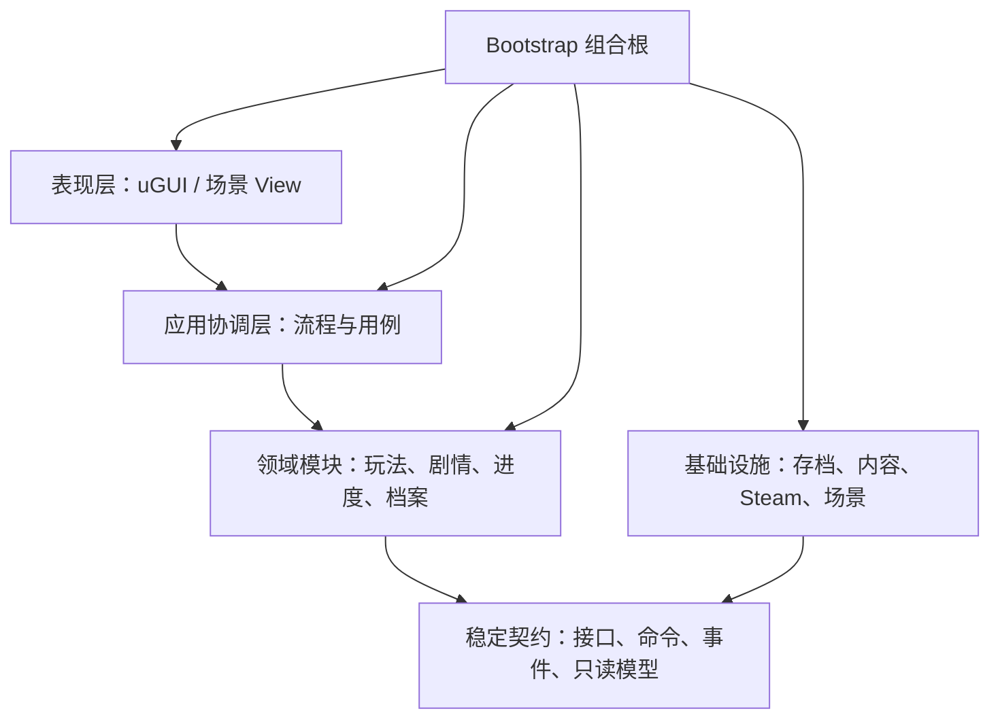
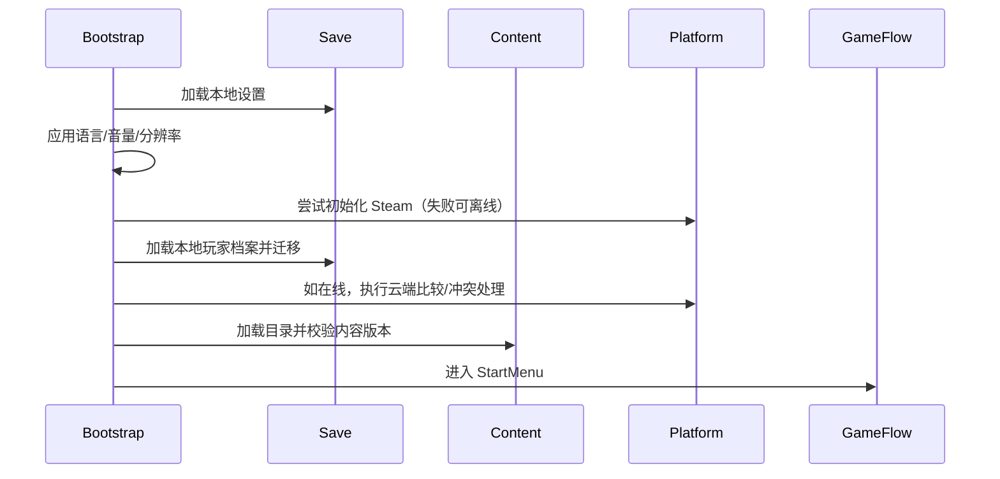
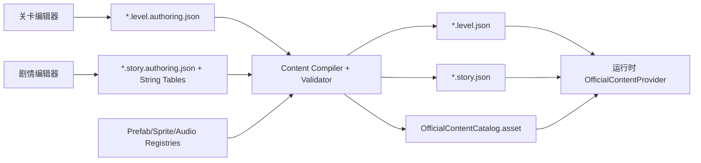
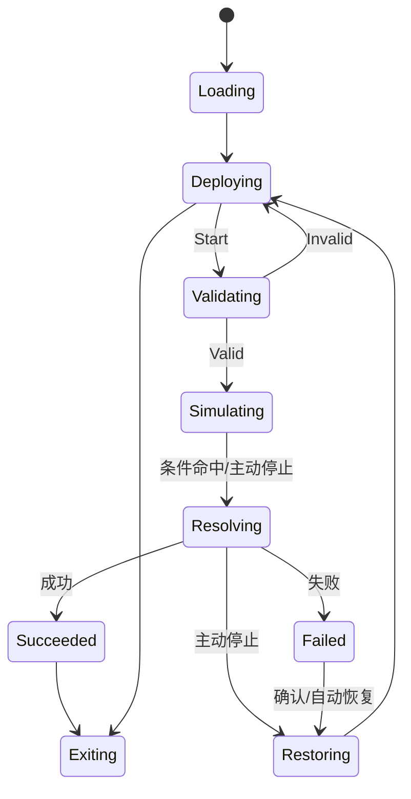
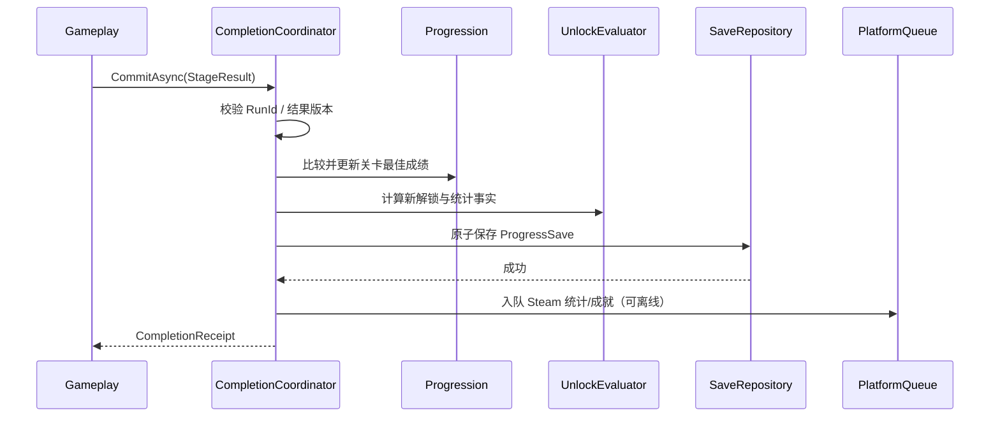

# Unity 2D 横版能力框建造解谜游戏——完整技术设计文档

> 文档版本：1.0  
> 目标引擎：Unity 2022.3.62f3c1 LTS  
> 目标平台：Windows PC / Steam  
> 渲染管线：Built-in Render Pipeline  
> 文档用途：作为项目从零搭建时的架构、模块、工程目录、存档结构及跨模块接口依据

---

## 1. 文档范围与已确认决策

### 1.1 产品范围

本项目是鼠标操作为主的 2D 横版建造解谜游戏。玩家不搭建桥梁、道路或杆件，而是在关卡允许区域内部署固定尺寸、不可旋转的“能力框”。目标小车、货物或障碍物进入能力框后，按照框体类型受到速度修改、障碍移除等专用效果影响。

首发主要功能域：

- 开始界面；
- 剧情界面；
- 主界面（驾驶舱）：地图、档案、人员，以及暂不开放内容的休息室入口；
- 关卡界面：部署、模拟、失败恢复、成功结算；
- 设置、本地存档和 Steam 接入；
- Unity 内的关卡编辑器、剧情编辑器和内容校验工具。

### 1.2 已确认的核心规则

- 玩家只在部署阶段新增、移动或删除能力框；模拟阶段完全锁定编辑。
- 能力框可重叠。不同类型的效果可以叠加；同类型同时覆盖同一目标时只生效一次。
- 同类型冲突统一按“优先级高者优先；优先级相同取效果强者；仍相同按稳定实例 ID”决议。
- 框体尺寸由类型配置提供固定选项，玩家不能自由缩放或旋转。
- 框体不得超出可部署区域，也不得与起点、终点及其他禁放区域相交。
- 容量费用由“框体类型 + 尺寸选项”决定；每个已部署框体均独立计费，重叠不减免费用。
- 总费用小于或等于关卡容量上限时允许开始；超过上限时禁止开始。
- 点击开始后小车运行，模拟开始计时；掉出场景、货物进水等配置化失败条件触发失败；在未失败的前提下满足终点等全部成功条件才算通关。
- 失败或主动停止后重建关卡初始状态，并保留开始前的能力框部署方案；“重置”只在部署阶段清空全部能力框。
- 不提供运行中的暂停和倍速。
- 成绩只保存每关一条最佳记录：优先比较通关耗时，耗时相同时比较容量消耗。选关资料卡显示该记录的耗时与容量。
- 关卡决定可用角色和能力框；不可用框体在 UI 中显示禁用状态。
- 关卡解锁使用可配置有向图，支持“满足任意前置”与“满足全部前置”。
- 剧情选项允许短暂分支后汇合；选择结果不进入永久存档，但本次剧情历史必须包含实际经过的分支文本。

### 1.3 技术边界

- 运行时 UI 统一使用 uGUI；自定义内容编辑器使用 UI Toolkit。
- 能力框是 2D 场景实体，不是 uGUI 窗口；框体范围由 Collider2D/专用范围逻辑表达。
- 关卡由受控预制体库和版本化关卡数据生成，不为每一关制作独立 Unity Scene。
- 剧情使用自定义事件序列，不使用 Timeline 作为主流程。
- 首发内容随安装包发布，通过 Steam 客户端补丁更新；不引入远程内容热更新和 Addressables。
- 首发接入 Steam 启动、云存档、成就和统计；排行榜暂不实现，只保留抽象接口；创意工坊只保留边界，不提供首发 UI 和上传下载实现。
- UGC 未来只允许使用官方白名单预制体编辑场景、起点和终点，不允许脚本、外部程序集或任意外部资源。
- 使用 Unity 原生 2D 物理。目标调整为：锁定游戏、引擎和物理配置版本后尽量可复现，不承诺跨 Unity 版本的严格确定性。

### 1.4 非目标

- 不设计多人联机、服务端权威模拟或反作弊。
- 不设计首发 UGC 编辑、发布、订阅和创意工坊工作流。
- 不设计排行榜数据和 UI。
- 不设计运行时热更新、DLC 内容下载或远程配置。
- 不将所有框体效果抽象为可由策划自由拼装的通用效果语言；首发每种框体使用专用逻辑。
- 不以玩家电脑时间作为游戏进度依据。驾驶舱日期时间仅作显示用途。

---

## 2. 总体架构

### 2.1 架构风格

采用“模块化单体 + 分层 + 组合根”的架构：所有模块打包在同一个 Unity 客户端中，但模块之间只通过公开接口、命令、查询对象和领域事件通信。



关键原则：

1. `MonoBehaviour` 负责 Unity 生命周期、场景对象和表现绑定，不直接决定永久进度或写文件。
2. 业务模块不能直接读取 JSON、调用 Steamworks API 或跳转 Scene。
3. UI 通过用例接口发出命令，通过只读 ViewModel/事件刷新，不直接修改存档 DTO。
4. Bootstrap 是唯一允许了解全部具体实现并完成依赖装配的位置。
5. 关键事务采用显式协调器调用；全局事件只通知已经发生的事实，不承担必须成功的主流程。
6. 不在业务代码中使用全局静态 `Manager.Instance` 或运行时 Service Locator。

### 2.2 层与职责

| 层 | 职责 | 不应包含 |
|---|---|---|
| Foundation/Contracts | ID、Result、接口、跨模块事件、只读模型 | 具体 Unity View、文件 IO、Steam API |
| Domain | 关卡规则、部署规则、成绩比较、解锁、剧情流程 | uGUI、文件路径、Scene 加载 |
| Application | 启动、首次流程、关卡完成事务、场景返回栈 | 具体序列化和具体 Steam SDK 调用 |
| Infrastructure | JSON、原子写入、内容提供者、Steam 适配器、系统时间 | 关卡胜负规则和 UI |
| Presentation | Canvas、Presenter、动画、音频和输入转发 | 直接改 ProgressSave、直接发 Steam 成就 |
| Bootstrap | 创建具体实现、注册生命周期、启动应用 | 业务规则 |

### 2.3 依赖方向

允许：

```text
Game.Presentation  -> Game.Contracts, Game.Foundation
Game.Flow          -> Game.Contracts, Game.Foundation
各业务模块          -> Game.Contracts, Game.Foundation
各基础设施模块       -> Game.Contracts, Game.Foundation
Game.Bootstrap      -> 所有运行时程序集
各 Editor 程序集    -> 对应 Runtime Data + UnityEditor
```

禁止：

```text
Gameplay -> Story 具体实现
Progression -> Steamworks.NET
UI -> Newtonsoft.Json / System.IO
Story -> SceneManager
任意 Runtime 程序集 -> UnityEditor
Foundation/Contracts -> 业务模块
```

`Game.Contracts` 是稳定边界，不应变成杂物目录。只有确实跨模块的类型进入该程序集；模块内部 DTO、辅助类、MonoBehaviour 必须留在模块内部。

### 2.4 关键流程的通信策略

- **命令/查询接口**：需要结果或可能失败的操作，如开始模拟、提交通关、保存、切换页面。
- **显式协调器**：需要固定顺序和一致性的跨模块流程，如通关提交。
- **领域事件**：一个事实可能有多个非关键订阅者，如 `UnlocksGrantedEvent` 驱动 UI 提示和音效。
- **禁止用 EventBus 完成关键事务**：事件订阅顺序和异常不可作为存档正确性的前提。

---

## 3. Unity Scene 与应用生命周期

### 3.1 Scene 划分

Build Settings 中的固定场景：

```text
00_Bootstrap.unity
01_StartMenu.unity
02_MetaHub.unity
03_Story.unity
04_Gameplay.unity
```

- `00_Bootstrap`：首个加载且常驻，包含 `GameRoot`、场景协调器、全局音频、输入和加载遮罩。
- 其余为功能场景，每次只保持一个主功能场景；由 Bootstrap 以 Additive 方式加载、设为 Active，再卸载前一个功能场景。
- 运行关卡时，`04_Gameplay` 额外创建一个仅承载关卡实体的本地 `PhysicsScene2D`。Gameplay 的 Canvas、相机控制和协调器不放入该物理场景。
- 设置弹窗、结算弹窗、昵称输入和加载遮罩使用 Prefab/Canvas Layer，不为每个弹窗创建 Scene。

### 3.2 启动顺序



任何非致命 Steam 故障不得阻止进入游戏。内容目录损坏、存档无法读取且备份也失败等阻断性错误，应进入可本地化的错误页，而不是留在黑屏。

### 3.3 “开始游戏”流程

- 无有效玩家档案：输入昵称 -> 保存 -> 播放序章 -> 进入主界面地图页。
- 有有效玩家档案：进入主界面，并恢复上次打开的主界面页面；若该页面为尚未开放的休息室，则回退到地图页。
- 首次进入某关：关前剧情 -> Gameplay。
- 再次进入某关：直接进入 Gameplay；资料卡仍可通过按钮重播已解锁关前剧情。
- 首次通关：提交结果与解锁 -> 关后剧情 -> 返回地图并刷新节点。
- 重玩通关：提交可能更优的结果；已播放过关后剧情时可直接返回结算/地图，具体是否自动重播由关卡配置决定。

### 3.4 应用流程接口

```csharp
public interface IGameFlowService
{
    Task EnterStartMenuAsync(CancellationToken cancellationToken);
    Task StartOrContinueAsync(CancellationToken cancellationToken);
    Task OpenMetaHubAsync(MetaPageId page, CancellationToken cancellationToken);
    Task EnterLevelAsync(LevelId levelId, CancellationToken cancellationToken);
    Task PlayStoryAsync(StoryId storyId, StoryReturnTarget returnTarget,
        CancellationToken cancellationToken);
    Task ReturnToStartMenuAsync(CancellationToken cancellationToken);
    Task QuitGameAsync(CancellationToken cancellationToken);
}
```

`StoryReturnTarget` 是显式返回目标，不依赖“猜测上一个 Scene”。所有异步场景请求应带取消标记，并在切换期间锁定重复点击。

---

## 4. 工程目录与 Assembly Definition 结构

### 4.1 推荐目录树

```text
Assets/
└── Game/
    ├── Runtime/
    │   ├── Foundation/
    │   ├── Contracts/
    │   ├── Flow/
    │   ├── Content/
    │   ├── Persistence/
    │   ├── Platform/
    │   ├── Audio/
    │   ├── Localization/
    │   ├── Progression/
    │   ├── Story/
    │   ├── Meta/
    │   ├── Gameplay/
    │   │   ├── Stage/
    │   │   ├── Placement/
    │   │   ├── Abilities/
    │   │   ├── Conditions/
    │   │   ├── Physics/
    │   │   └── Results/
    │   ├── Presentation/
    │   │   ├── Common/
    │   │   ├── StartMenu/
    │   │   ├── MetaHub/
    │   │   ├── Story/
    │   │   └── Gameplay/
    │   └── Bootstrap/
    ├── Editor/
    │   ├── ContentCommon/
    │   ├── LevelEditor/
    │   ├── StoryEditor/
    │   └── BuildValidation/
    ├── Content/
    │   ├── Authoring/
    │   │   ├── Levels/
    │   │   └── Stories/
    │   ├── Generated/
    │   │   ├── Levels/
    │   │   ├── Stories/
    │   │   └── Catalogs/
    │   ├── Definitions/
    │   │   ├── Characters/
    │   │   ├── Archives/
    │   │   ├── Maps/
    │   │   ├── News/
    │   │   └── UnlockRules/
    │   └── Registries/
    ├── Art/
    ├── Audio/
    ├── Localization/
    ├── Prefabs/
    ├── Scenes/
    ├── Settings/
    └── Tests/
        ├── EditMode/
        └── PlayMode/
Packages/
ThirdPartyNotices/
```

规则：

- `Authoring` 是编辑源数据；`Generated` 是编译产物。运行时只读取 Generated，不读取 Editor 元数据。
- 生成文件必须可重复生成；同一输入不应因时间戳或遍历顺序产生无意义差异。
- 第三方源码尽量由 UPM/Git URL/Asset Store 管理，不混入 `Assets/Game/Runtime`。
- 所有第三方许可证和版本锁定记录集中在 `ThirdPartyNotices`。
- ```mermaid
flowchart TD
    UI["Presentation<br/>玩家点击开始"] --> APP["Application<br/>组织关卡运行流程"]
    APP --> DOMAIN["Domain<br/>校验部署并执行游戏规则"]
    DOMAIN --> RESULT["Contracts<br/>生成统一的 StageResult"]
    RESULT --> APP2["Application<br/>组织通关提交流程"]
    APP2 --> RULE["Domain<br/>比较最佳成绩、计算解锁"]
    APP2 --> SAVE["Infrastructure<br/>写入 JSON 存档"]
    APP2 --> STEAM["Infrastructure<br/>同步 Steam"]
    APP2 --> UI2["Presentation<br/>显示结算界面"]
```
### 4.2 程序集划分

| asmdef | 核心内容 | 主要依赖 |
|---|---|---|
| `Game.Foundation` | ID、Result、校验、通用集合 | UnityEngine（仅必要部分） |
| `Game.Contracts` | 跨模块接口、命令、事件、只读模型 | Foundation |
| `Game.Flow` | 启动、返回栈、完成事务协调 | Contracts |
| `Game.Content` | 官方内容目录与 Provider | Contracts, Newtonsoft.Json |
| `Game.Persistence` | Repository、迁移、原子写入 | Contracts, Newtonsoft.Json |
| `Game.Platform` | Steam/离线适配器、同步队列 | Contracts, Steamworks.NET |
| `Game.Audio` | Mixer、音乐/音效播放和场景音乐切换 | Contracts |
| `Game.Localization` | Locale、String Table 访问和格式化 | Contracts, Unity Localization |
| `Game.Progression` | 解锁事实、规则和最佳成绩 | Contracts |
| `Game.Story` | StoryRunner、节点执行器、历史 | Contracts |
| `Game.Meta` | 地图/档案/人员查询服务 | Contracts |
| `Game.Gameplay` | 部署、物理、能力、条件、结算 | Contracts |
| `Game.Presentation` | uGUI View/Presenter/Input Adapter | Contracts, Input System, Localization |
| `Game.Bootstrap` | 组合根和全局生命周期 | 全部运行时程序集 |
| `Game.Editor.Content` | 内容编译与共用控件 | Content, UnityEditor |
| `Game.Editor.Level` | 关卡编辑器 | Gameplay, Editor.Content |
| `Game.Editor.Story` | 剧情编辑器 | Story, Editor.Content |
| `Game.Editor.Validation` | 构建前校验 | 相关 Runtime, Editor.Content |
| `Game.Tests.EditMode` | 纯规则、序列化和迁移测试 | 被测 Runtime |
| `Game.Tests.PlayMode` | 场景、物理、UI 测试 | 被测 Runtime |

禁止使用一个覆盖全部源码的 `Assembly-CSharp`。同时不要为每个小类建立 asmdef；上表粒度足以隔离模块和缩短增量编译。

### 4.3 命名约定

- 稳定内容 ID：小写命名空间形式，例如 `official.level.factory_001`。
- C# 强类型 ID：`LevelId`、`StoryId`、`AbilityTypeId`，避免不同 ID 都以裸 `string` 互传。
- Unity 资源名称可以面向人员可读，但运行时引用必须使用稳定 ID，不使用显示名和数组下标。
- 所有玩家可见文本使用本地化 Key；中文只是默认语言，不将中文正文写死在代码或关卡 JSON 中。

---

## 5. 内容数据与制作流水线

### 5.1 为什么不把全部内容放进大型 ScriptableObject

大量剧情正文和关卡位置数据直接堆在大型 SO 中，会带来合并冲突、Diff 不清晰、批量校验困难和未来 UGC 格式不一致的问题。本项目采用混合方案：

- **版本化 JSON DTO**：关卡空间数据、剧情节点关系、条件参数；
- **Unity Localization String Table**：剧情、档案、角色、新闻及 UI 正文；
- **小型 ScriptableObject Registry/Catalog**：Prefab、Sprite、AudioClip 等 Unity 资源的稳定 ID 到对象引用；
- **UI Toolkit 自定义编辑器**：策划无需手改 JSON；编辑器负责预览、写入、校验和编译。

SO 在这里仍有价值，但只做资源注册表和少量定义，不承担大型文本数据库。

### 5.2 内容编译流程



编译器必须：

- 排除编辑器视口、选中状态等 Authoring 元数据；
- 对对象、节点和条件按稳定 ID 排序；
- 写入 `formatVersion`、`contentRevision` 和校验摘要；
- 校验所有 ID 唯一且引用存在；
- 检测剧情不可达节点、死循环（显式允许的循环除外）和未汇合分支；
- 检测关卡起点/终点数量、部署区、禁放区、对象越界和条件参数；
- 构建前若存在 Error 级问题则阻止 Player Build。

### 5.3 运行时内容接口

```csharp
public interface IContentService
{
    LevelDefinition GetLevel(LevelId levelId);
    StoryDefinition GetStory(StoryId storyId);
    CharacterDefinition GetCharacter(CharacterId characterId);
    ArchiveEntryDefinition GetArchiveEntry(ArchiveEntryId entryId);
    IReadOnlyList<LevelSummary> GetLevelsForMap(MapId mapId);
    ContentCompatibility CheckCompatibility(ContentHeader header);
}

public interface IContentProvider
{
    ContentSource Source { get; }
    bool TryGetLevel(LevelId levelId, out LevelDefinition definition);
    bool TryGetStory(StoryId storyId, out StoryDefinition definition);
}
```

首发只注册 `OfficialContentProvider`。未来增加 `UgcContentProvider` 时，Gameplay 不需要改为直接读文件，只由 `IContentService` 根据带来源的 ContentId 路由。

### 5.4 关卡核心数据

```csharp
[Serializable]
public sealed class LevelDefinition
{
    public ContentHeader Header;
    public string LevelId;
    public string MapId;
    public string DisplayNameKey;
    public int CapacityLimit;
    public PhysicsProfileData PhysicsProfile;
    public BoundsData WorldBounds;
    public List<ZoneData> DeployableZones;
    public List<ZoneData> ForbiddenZones;
    public SpawnPointData StartPoint;
    public GoalPointData GoalPoint;
    public List<StageObjectData> Objects;
    public List<AllowedAbilityData> AllowedAbilities;
    public List<ConditionData> SuccessConditions;
    public List<ConditionData> FailureConditions;
    public UnlockRequirementData UnlockRequirement;
    public string PreStoryId;
    public string PostStoryId;
}

[Serializable]
public sealed class AllowedAbilityData
{
    public string CharacterId;
    public string AbilityTypeId;
    public List<AbilitySizeOptionData> SizeOptions;
}

[Serializable]
public sealed class AbilitySizeOptionData
{
    public string SizeOptionId;
    public float Width;
    public float Height;
    public int CapacityCost;
    public int EffectPriority;
}
```

`StageObjectData` 只保存 `PrefabId`、稳定对象 ID、位置、角度、缩放及白名单参数。官方关卡可配置对象角度；“能力框不可旋转”是玩家部署规则，不限制关卡静态物件。

### 5.5 关卡编辑器

UI Toolkit `LevelEditorWindow` 至少包含：

- 关卡列表与元数据；
- 2D 视口、平移和缩放；
- 白名单预制体调色板；
- 起点、终点、世界边界、部署区和禁放区编辑；
- 场景对象选择、移动、旋转和白名单参数 Inspector；
- 可用角色/能力框/尺寸/容量配置；
- 成功与失败条件库配置；
- 解锁前置图配置；
- 一键校验、编译和进入测试模式。

编辑器不得直接把当前 Unity Scene 当作关卡真相来源。预览场景是数据的投影，保存时回写 Authoring DTO。

### 5.6 剧情编辑器与节点

剧情采用顺序事件 + 显式跳转/分支节点：

```text
Dialogue        显示说话人和正文
Choice          显示选项并跳往分支
Goto            跳转/汇合
SetBackground   背景切换
ShowCharacter   立绘、位置、表情、明暗
HideCharacter   隐藏立绘
MoveCharacter   位置移动
PlayAudio       音乐/音效
ScreenEffect    黑白红光、抖动、模糊等
ShowCg          全屏 CG 与缩放演出
Wait            可跳过等待
End             正常结束
```

每个 Dialogue/Choice 节点引用本地化 Key。角色形象引用 `CharacterId + AppearanceId + ExpressionId`，与人员页面共用同一角色资源注册表，避免剧情和档案各自维护重复引用。

`StoryEditorWindow` 提供节点列表/分支视图、属性面板、实时预览、引用检查和分支可达性检查。首发不使用 Timeline；若未来出现复杂镜头，可增加一个可选 `PlayTimelineNodeExecutor`，不改变 StoryRunner 核心。

---

## 6. 关卡运行模块

### 6.1 职责拆分

| 子模块 | 负责 | 不负责 |
|---|---|---|
| `StageSession` | 单次关卡会话状态机和命令入口 | 永久存档、Steam |
| `StageWorldBuilder` | 根据关卡数据创建/销毁物理世界 | 玩家输入 |
| `PlacementService` | 能力框增删移动、费用和合法性 | 能力实际效果 |
| `SimulationLoop` | 固定 Tick 驱动物理和规则阶段 | UI 动画时间 |
| `AbilityRuntimeRegistry` | 将能力类型 ID 映射到专用运行逻辑 | 策划脚本化新能力 |
| `EffectResolver` | 同类型去重、优先级决议、进入/离开恢复 | 永久成绩 |
| `ConditionEngine` | 配置化成功/失败条件 | 关卡解锁 |
| `ResultCalculator` | 生成不可变通关结果 | 写文件 |
| `GameplayPresenter` | HUD、拖拽反馈、结算显示 | 决定合法性和胜负 |

### 6.2 会话状态机

```csharp
public enum StageSessionState
{
    Unloaded,
    Loading,
    Deploying,
    Validating,
    Simulating,
    Resolving,
    Restoring,
    Succeeded,
    Failed,
    Exiting
}
```

合法迁移：



状态约束：

- 只有 `Deploying` 接受放置、移动、删除和重置命令。
- `Validating` 后立即冻结部署方案，直到回到 `Deploying`。
- `Simulating` 不接收暂停、倍速或编辑命令，只接收主动停止。
- 成功一经形成即不可恢复到同一运行，避免重复提交成绩；重试需要新建一次运行。

### 6.3 关卡会话接口

```csharp
public interface IStageSession
{
    StageSessionState State { get; }
    LevelId LevelId { get; }
    DeploymentPlanSnapshot Deployment { get; }

    Result<PlacementId> PlaceAbility(PlaceAbilityCommand command);
    Result MoveAbility(MoveAbilityCommand command);
    Result RemoveAbility(PlacementId placementId);
    Result ClearDeployment();
    StartSimulationResult StartSimulation();
    Result StopSimulation();
}

public readonly struct PlaceAbilityCommand
{
    public readonly AbilityTypeId AbilityTypeId;
    public readonly AbilitySizeId SizeId;
    public readonly Vector2 WorldPosition;

    public PlaceAbilityCommand(AbilityTypeId abilityTypeId,
        AbilitySizeId sizeId, Vector2 worldPosition)
    {
        AbilityTypeId = abilityTypeId;
        SizeId = sizeId;
        WorldPosition = worldPosition;
    }
}

public sealed class DeploymentPlanSnapshot
{
    public IReadOnlyList<AbilityPlacementData> Placements { get; }
    public int TotalCapacity { get; }
    public int CapacityLimit { get; }

    public DeploymentPlanSnapshot(IReadOnlyList<AbilityPlacementData> placements,
        int totalCapacity, int capacityLimit)
    {
        Placements = placements;
        TotalCapacity = totalCapacity;
        CapacityLimit = capacityLimit;
    }
}
```

所有命令在领域层再次校验。UI 中按钮变灰和红色预览只是反馈，不能替代规则校验。

### 6.4 部署数据与合法性

```csharp
[Serializable]
public sealed class AbilityPlacementData
{
    public string PlacementId;
    public string AbilityTypeId;
    public string SizeOptionId;
    public float PositionX;
    public float PositionY;
}

public enum PlacementError
{
    None,
    SessionLocked,
    AbilityNotAllowed,
    UnknownSize,
    OutsideDeployableArea,
    OverlapsForbiddenArea,
    InvalidNumber,
    CapacityExceeded
}
```

部署规则分两层：

1. **编辑时预检**：拖拽每帧使用几何查询显示绿色/红色预览。超容量时允许玩家继续调整已有方案，但新放置命令应直接拒绝，避免存储非法方案。若策划希望允许超额试摆，只需把该规则改为“允许放置、禁止开始”；首发默认拒绝超额新放置。
2. **开始前权威校验**：重新检查所有 ID、有限数值、尺寸、容量、部署区、禁放区和关卡白名单，防止 UI 状态过期。

空间判定以完整矩形四角和边界相交为准，不只检查中心点。使用统一的 `PlacementGeometry` 计算，编辑器预览和运行时共享同一实现，避免“编辑器能放、游戏不能放”。位置在保存到部署方案时量化到固定网格精度（例如 1/1000 世界单位），消除鼠标浮点抖动；网格精度作为项目常量写入内容版本。

容量策略：

```text
placementCost = SizeOption.CapacityCost
totalCapacity = Sum(all placementCost)
canStart = totalCapacity <= level.CapacityLimit && allPlacementsValid
```

### 6.5 世界创建与失败恢复

进入 Gameplay 后，保留两份不可变数据：

- `LevelDefinition`：官方关卡初始状态；
- `DeploymentPlanSnapshot`：玩家当前方案。

模拟世界不作为真相来源。每次开始模拟：

1. 销毁上一次运行的关卡物理 Scene；
2. 创建带 `LocalPhysicsMode.Physics2D` 的本地 Scene；
3. 按稳定对象 ID 排序实例化关卡对象；
4. 按稳定 PlacementId 排序实例化能力框；
5. 初始化条件、效果解析器和运行时注册表；
6. 将动态刚体唤醒状态、初速度等设为关卡配置值；
7. 从 Tick 0 开始模拟。

失败或主动停止时销毁该物理 Scene，重新生成部署阶段预览，并重用原 `DeploymentPlanSnapshot`。不要尝试只把 Transform、速度写回初值：Unity 物理还持有接触对、关节、Sleep 状态等内部状态，局部复位容易产生残留。

“重置”只调用 `ClearDeployment()`，不会修改关卡静态对象，也不会产生永久存档。

### 6.6 固定 Tick 物理循环

为提高同一游戏版本内的复现性，关卡物理使用脚本驱动的固定步长，而非把计时和规则散落在 `Update`/`FixedUpdate`：

```csharp
public interface ISimulationLoop
{
    long CurrentTick { get; }
    double TickSeconds { get; }
    void AdvanceFrame(double unscaledFrameSeconds);
}
```

推荐初始值为 60 Hz，即 `TickSeconds = 1.0 / 60.0`；最终数值须通过目标硬件性能与高速碰撞测试确认，确认后作为 `PhysicsProfile` 的版本化参数锁定。

项目级 `Physics2D.simulationMode` 固定为 `SimulationMode2D.Script`。`SimulationLoop` 获取 Gameplay 本地 Scene 的 `PhysicsScene2D` 并只调用 `localPhysicsScene.Simulate(fixedDelta)`；不调用会推进默认场景的全局 `Physics2D.Simulate`。非默认本地物理 Scene 不会被 Unity 自动推进，其生命周期随承载 Scene 销毁。开始界面、剧情和主界面不得依赖自动 Rigidbody2D 动画；如未来确有需要，必须通过另一个显式 Simulation Owner 推进，不能临时切换全局模式。

单个 Tick 的固定阶段：

```text
1. ApplyQueuedCommands（首发通常为空）
2. AbilityPrePhysicsTick
3. PhysicsScene2D.Simulate(fixedDelta)
4. CollectContactFacts
5. AbilityPostPhysicsTick / EffectResolver
6. ConditionEngine.Evaluate
7. ResolveOutcome（同 Tick 失败优先于成功）
8. currentTick++
```

渲染帧只把 `unscaledDeltaTime` 加入累加器，并执行零到若干个固定 Tick。通关耗时定义为：

```text
elapsedTicks * tickDuration
```

存档保存 `elapsedTicks` 与 `tickRate`，比较成绩时优先用整数 Tick；UI 再格式化为秒。禁止用 `Time.time`、帧数或系统时钟计算成绩。

为避免单帧卡顿造成无限追赶，应设置 `maxTicksPerFrame`。达到上限后保持待模拟的累积时间并让画面变慢，不丢弃 Tick；因此性能下降不会让计时成绩变快。若累计落后超过安全阈值，终止本次运行并显示“模拟性能不足”，该运行不形成失败成绩。

### 6.7 原生 2D 物理可复现策略

Unity 原生 2D 物理不作为跨电脑、跨引擎版本严格确定性方案。本项目只承诺锁定构建下的尽量可复现，并执行以下约束：

- 锁定 Unity `2022.3.62f3c1`、包版本、Windows 架构和 Scripting Backend；升级引擎必须重跑物理回归集。
- 锁定 Gravity、Velocity/Position Iterations、Contact Offset、Layer Collision Matrix 等物理设置，并计算 `physicsProfileHash`。
- 使用固定 Tick 和本地 `PhysicsScene2D.Simulate`。
- 所有物体按稳定 ID 创建；所有自写集合遍历在影响结果前明确排序。
- 不在 `Update` 中对刚体写 Transform；物理期间只通过统一 Tick 接口施加力、速度或状态。
- 不用 `UnityEngine.Random` 决定玩法结果；确需随机时使用记录种子的项目随机源。
- 物理查询结果进入规则层前按稳定 EntityId 排序，不能依赖回调或查询原始顺序。
- 碰撞回调只记录事实，在 Tick 固定阶段统一处理，不在回调中直接判胜、切 Scene 或存档。
- 能力框、成功/失败条件使用显式触发集合，并能在实体禁用/销毁时清理贡献。

每条成绩保存 `gameBuildVersion`、`levelContentRevision`、`scoreRuleVersion`、`physicsProfileHash`。内容小修且成绩规则兼容时保持 `scoreRuleVersion`；若关卡几何或规则变化导致成绩不可比，则提升该版本。旧成绩保留为 legacy 数据用于不丢失历史，但资料卡只把当前规则版本的记录作为当前最佳；关卡完成状态和解锁不回退。

### 6.8 能力框运行模型

首发能力种类固定，每类使用专用 Factory/Runtime，不设计策划脚本语言：

```csharp
public interface IAbilityRuntimeFactory
{
    AbilityTypeId AbilityTypeId { get; }
    IAbilityRuntime Create(AbilityRuntimeContext context);
}

public interface IAbilityRuntime : IDisposable
{
    PlacementId PlacementId { get; }
    void Initialize();
    void PrePhysicsTick(in SimulationTick tick);
    void PostPhysicsTick(in SimulationTick tick);
}

public interface IEffectResolver
{
    void AddOrUpdate(EffectContribution contribution);
    void Remove(EffectSourceId sourceId, EntityId targetId);
    void RemoveAllFromSource(EffectSourceId sourceId);
    ResolvedEffects ResolveFor(EntityId targetId);
}
```

每个范围框跟踪 `HashSet<EntityId>`，在进入时登记贡献、离开时移除贡献、销毁时执行 `RemoveAllFromSource`。不同类型的贡献由目标自身的组件模型组合；同类型只选择一个 Winner：

```text
EffectPriority 降序
EffectStrength 降序
PlacementId 升序（稳定兜底）
```

“相同框只能生效一次”指同一目标在重叠范围内只有一个同类型贡献成为 Winner，并不免除每个框的容量成本。

### 6.9 速度框示例

```csharp
public sealed class SpeedZoneRuntime : IAbilityRuntime
{
    private readonly IZoneOccupancy _occupancy;
    private readonly IEffectResolver _effects;
    private readonly SpeedZoneConfig _config;

    public void PostPhysicsTick(in SimulationTick tick)
    {
        foreach (EntityId entered in _occupancy.ConsumeEnteredSorted())
        {
            _effects.AddOrUpdate(new EffectContribution(
                sourceId: EffectSourceId.From(PlacementId),
                targetId: entered,
                type: EffectTypeId.Speed,
                priority: _config.Priority,
                strength: _config.Multiplier,
                payload: new SpeedMultiplier(_config.Multiplier)));
        }

        foreach (EntityId exited in _occupancy.ConsumeExitedSorted())
            _effects.Remove(EffectSourceId.From(PlacementId), exited);
    }
}
```

目标的 `VehicleMotionController` 持有基础运动参数，每 Tick 从 `ResolvedEffects` 计算最终参数：

```text
effectiveSpeed = baseSpeed * winningSpeedMultiplier
```

离开最后一个速度框后，Resolver 不再返回速度贡献，目标自然恢复 `baseSpeed`。禁止在 Enter 时保存“旧速度”、Exit 时原样写回；这种做法在多框重叠、效果切换或其他减速效果同时存在时会恢复错误。

### 6.10 条件系统

关卡从程序预先实现的条件库中选择类型并填写参数：

```csharp
public interface IConditionFactory
{
    ConditionTypeId TypeId { get; }
    IRuntimeCondition Create(ConditionData data, StageRuntimeContext context);
}

public interface IRuntimeCondition
{
    ConditionStatus Evaluate(in ConditionTickContext context);
}

public enum ConditionStatus { Pending, Satisfied, Violated }
public enum MatchMode { All, Any }
```

首批条件类型建议：

| 条件 | 常用用途 | 参数示例 |
|---|---|---|
| `EntityReachedGoal` | 小车/货物到达终点 | EntityId、GoalId、停留 Tick |
| `EntityOutsideBounds` | 小车掉出场景 | EntityId/Tag、BoundsId |
| `EntityEnteredHazard` | 货物进水等 | EntityId/Tag、HazardId |
| `EntityDestroyed` | 关键对象损毁 | EntityId/Tag |
| `CargoDetached` | 运输关系破坏 | CargoId、VehicleId |
| `MaxSimulationTicks` | 超时失败 | MaxTicks |
| `RequiredEntitiesAtGoal` | 多目标全部抵达 | EntityId 列表 |

成功条件默认 `All`；失败条件默认 `Any`。同一个 Tick 同时出现成功和失败时，先解析失败，避免“货物落水同时碰到终点”的歧义。若个别关卡需要其他优先级，必须显式配置 `OutcomePriority`，不可依赖碰撞回调先后。

### 6.11 结果计算

```csharp
public sealed class StageResult
{
    public Guid RunId { get; }
    public LevelId LevelId { get; }
    public long ElapsedTicks { get; }
    public int TickRate { get; }
    public int CapacityUsed { get; }
    public string GameBuildVersion { get; }
    public int LevelContentRevision { get; }
    public int ScoreRuleVersion { get; }
    public string PhysicsProfileHash { get; }
    public DateTimeOffset CompletedAtUtc { get; }

    // 构造函数对所有字段赋值，省略以保持示例简洁。
}

public static int CompareScore(StageResult left, StageResult right)
{
    int time = left.ElapsedTicks.CompareTo(right.ElapsedTicks);
    return time != 0 ? time : left.CapacityUsed.CompareTo(right.CapacityUsed);
}
```

`CompletedAtUtc` 只用于诊断、云冲突和显示，不参与成绩。容量使用来自开始时冻结的部署方案，不从模拟结束时仍存活的框体反推。

---

## 7. 进度、解锁与通关事务

### 7.1 Progression 模块职责

- 判断关卡、剧情按钮、档案条目、角色和立绘是否解锁；
- 保存已完成关卡事实和当前版本最佳成绩；
- 执行统一解锁规则；
- 向地图、档案、人员和剧情模块提供只读查询；
- 不负责 Scene 加载、Steam API 和 UI 动画。

### 7.2 统一解锁规则

```csharp
public sealed class UnlockRuleData
{
    public string RuleId;
    public MatchMode MatchMode;
    public List<UnlockConditionData> Conditions;
    public List<UnlockTargetData> Targets;
}

public interface IUnlockEvaluator
{
    bool IsSatisfied(UnlockRequirementData requirement, ProgressSnapshot progress);
    UnlockEvaluationResult EvaluateNewUnlocks(ProgressSnapshot before,
        ProgressMutationFacts facts);
}
```

条件类型至少支持：

- 完成指定关卡；
- 完成任意/全部指定关卡；
- 播放完成指定剧情；
- 到达指定章节；
- 已解锁指定档案或角色；
- 首次通关、累计通关数等统计事实。

解锁目标可为关卡、剧情重播按钮、档案、角色、角色故事、立绘、地图、新闻。所有模块查询同一份 `ProgressSnapshot`，不各自保存重复的 `isUnlocked` 布尔值；存档只保存已经达成的事实和必须固化的解锁集合。

### 7.3 关卡有向图

关卡自身保存 `UnlockRequirement`，可表示：

```text
All(level_001, level_002)
Any(level_branch_a, level_branch_b)
```

构建校验必须检测：

- LevelId 引用存在；
- 除明确的初始节点外，每个节点有可满足路径；
- 不存在无法解开的强连通循环；
- 支线可结束而不必继续分岔；
- 地图与章节归属有效。

### 7.4 通关提交协调器

通关是跨模块关键事务，使用单一协调器而非多个事件订阅者各自写存档：

```csharp
public interface IStageCompletionCoordinator
{
    Task<CompletionReceipt> CommitAsync(StageResult result,
        CancellationToken cancellationToken);
}
```

固定执行顺序：



要求：

- `RunId` 幂等：同一次通关重复提交不得重复解锁或累计统计。
- 本地原子存档成功是提交成功的底线；Steam 失败不回滚本地进度。
- 若存档失败，保持结算页并允许重试，不播放关后剧情或退出关卡。
- 保存成功后发布 `StageCompletionCommittedEvent` 和 `UnlocksGrantedEvent`，供 UI、音频等非关键表现订阅。
- 最佳成绩比较为：耗时 Tick 更少优先；耗时相同容量更低优先。

`CompletionReceipt` 返回 `IsNewBest`、旧/新最佳、首次通关、新解锁目标和应播放的关后剧情 ID，Gameplay/Flow 据此展示结算并继续流程。

---

## 8. 剧情、地图、档案与人员模块

### 8.1 剧情运行时

```csharp
public interface IStoryService
{
    StorySession Start(StoryId storyId);
    Result Advance();
    Result Choose(ChoiceId choiceId);
    Result Skip();
    StorySnapshot GetSnapshot();
}

public interface IStoryPresentationPort
{
    Task ShowDialogueAsync(DialoguePresentation data, CancellationToken ct);
    Task ShowChoicesAsync(IReadOnlyList<ChoicePresentation> choices, CancellationToken ct);
    Task SetBackgroundAsync(BackgroundPresentation data, CancellationToken ct);
    Task SetCharacterAsync(CharacterPresentation data, CancellationToken ct);
    Task PlayScreenEffectAsync(ScreenEffectPresentation data, CancellationToken ct);
}
```

`StoryRunner` 执行纯节点流；节点执行器通过 `IStoryPresentationPort` 控制表现。跳过的语义为“以无等待模式执行必要状态节点直到 End”：最终背景、解锁事实和完成状态必须正确，非必要补间、打字机和 Wait 可立即完成。首发剧情节点不直接发放解锁；剧情结束后由 Flow 向 Progression 提交 `StoryCompletedFact`，再统一评估解锁。

剧情 UI 行为：

- 点击继续区域或按空格推进；鼠标必须能完成全部流程；
- 文本使用可立即完成的打字机效果：首次点击补全文本，再次点击进入下一节点；
- 选项只改变当前短分支，经过 Goto 汇合后返回同一主线；
- 跳过按钮需要二次确认，并跳过整段而不是只补全当前句；
- 历史按钮打开当前 StorySession 的滚动记录；
- 立绘支持左/中/右、明暗、淡入淡出、差分、抖动和位移，不通过任意缩放表现撞击；
- 背景支持淡入淡出、黑场和 CG 替换；屏幕支持白/红光、抖动、黑屏、模糊；
- 全屏 CG 可配置缓慢放大/缩小，播放时隐藏名字框与文本框，退出 CG 后恢复；
- 设置弹窗打开时冻结剧情推进输入，但不销毁当前节点状态。

### 8.2 剧情历史

```csharp
public sealed class StoryHistoryEntry
{
    public long Sequence { get; }
    public StoryId StoryId { get; }
    public StoryNodeId NodeId { get; }
    public CharacterId? SpeakerId { get; }
    public LocalizedTextSnapshot Speaker { get; }
    public LocalizedTextSnapshot Text { get; }
    public ChoiceId? SelectedChoiceId { get; }
    public bool IsChoice { get; }

    // 构造函数对所有字段赋值，省略以保持示例简洁。
}
```

- 历史记录属于当前 `StorySession` 的瞬时数据，不进入永久存档。
- 只有实际执行过的分支节点进入历史；未选择分支不显示。
- 玩家点击的选项作为一条 `IsChoice` 记录插入，随后记录该分支正文。
- `LocalizedTextSnapshot` 保存本次显示后的文本快照，确保玩家在当前会话中切换语言后，历史仍与当时所见一致；关闭剧情后即可释放。
- CG 播放时 UI 可隐藏名字框与文本框，但 History 仍保留前后正常对白。

### 8.3 主界面壳层

`02_MetaHub` 使用固定上栏、下栏、侧栏和可切换内容页：

```text
MetaHubShell
├── HeaderView
├── SidebarView
├── HeroNavigationView
├── MapPageView
├── ArchivePageView
├── CharacterPageView
└── LoungePlaceholderView
```

Hero 导航的“休息室/拜访员工”首发保留入口和接口，点击后显示本地化的“暂未开放”占位页；不创建空业务系统。页面切换不换 Scene，只替换/显隐页面 Presenter，并将最后页面 ID 写入玩家档案。

驾驶舱各区域的数据归属：

| 区域 | 内容 | 数据来源 |
|---|---|---|
| 上栏 | Logo/标语、章节编号与名称、当前页面类型、昵称、设置按钮 | 静态 Registry + ProgressQuery + 当前页面状态 + Profile |
| 下栏 | Logo/装饰、地图/档案/人员/休息室导航、真实日期时间 | 静态 View + MetaHub Router + IClock |
| 侧栏 | 新闻、探索进度、已解锁地图切换 | Content + Progression 合并查询 |
| 内容区 | 地图、档案、人员或休息室占位页 | 各页面 Presenter |

开始界面只有“开始游戏、设置、退出游戏”三个主操作；开始游戏由 Flow 判断首次/继续，退出在 Windows Player 调用 Application Quit，在 Editor 中只记录模拟退出，不让 UI 直接调用 Unity API。

驾驶舱时间通过以下抽象读取玩家电脑本地时间：

```csharp
public interface IClock
{
    DateTimeOffset UtcNow { get; }
    DateTimeOffset LocalNow { get; }
}
```

UI 每秒刷新一次。系统时间不可信，不参与解锁、成绩或存档排序；云冲突只把 UTC 时间作为辅助证据，以修订号和内容比较为主。

### 8.4 地图查询与交互

```csharp
public interface IMetaMapQuery
{
    IReadOnlyList<MapTabViewModel> GetVisibleMaps();
    IReadOnlyList<LevelNodeViewModel> GetNodes(MapId mapId);
    LevelCardViewModel GetLevelCard(LevelId levelId);
    ChapterHeaderViewModel GetCurrentChapter();
    ExplorationProgressViewModel GetExplorationProgress();
}
```

`LevelCardViewModel` 合并内容和玩家进度，包含：名称、编号、锁定/当前/已完成状态、最佳耗时与容量、关前/关后剧情重播权限。UI 不自行读取多个系统再拼接。

地图页面：

- 只显示已解锁地图；当前关所在地图显示提示；
- 未解锁关卡节点可按视觉设计隐藏或显示锁定占位，但不可交互；
- 节点选中时切换选中样式并打开资料卡；
- 支持鼠标拖动、滚轮缩放和定位当前关；缩放/平移逻辑由 `MapViewportController` 管理并做边界约束；
- 最佳成绩为空时显示 `-`；只显示当前 `scoreRuleVersion` 下的最佳记录。

### 8.5 档案模块

```csharp
public interface IArchiveQuery
{
    IReadOnlyList<ArchiveListItemViewModel> GetEntries(ArchiveCategoryId category);
    ArchiveEntryViewModel GetEntry(ArchiveEntryId entryId);
}
```

`ArchiveEntryDefinition` 保存分类、排序、标题 Key、正文段落 Key、图片/道具资源 ID 和统一解锁 Requirement。档案页包含：分类/选择区域、已解锁/未解锁状态、滚动正文、图片/道具展示与新解锁标记。

“关卡通关解锁档案”和“剧情解锁档案”都由统一 UnlockEvaluator 生成目标，不允许关卡脚本直接调用 Archive UI 或向 ArchiveSave 写数据。

### 8.6 人员模块

```csharp
public interface ICharacterQuery
{
    IReadOnlyList<CharacterListItemViewModel> GetCharacters();
    CharacterProfileViewModel GetProfile(CharacterId characterId);
    IReadOnlyList<AppearanceViewModel> GetAppearances(CharacterId characterId);
}
```

`CharacterDefinition` 包含：显示名、基础档案段落、头像、立绘 Appearance 列表、角色故事条目及各自解锁条件。人员页支持角色选择、锁定状态、立绘切换和滚动档案；角色故事与立绘随统一条件解锁。

剧情和人员页面共同使用 `ICharacterAssetRegistry`：

```csharp
public interface ICharacterAssetRegistry
{
    Sprite GetPortrait(CharacterId characterId, AppearanceId appearanceId,
        ExpressionId expressionId);
}
```

### 8.7 新闻、章节与探索进度

- 新闻为版本化内容条目，包含图片 ID、标题/正文 Key、优先级和显示条件。
- 当前章节由已完成关卡事实和章节配置推导，不写重复字段。
- 探索进度建议定义为“当前地图已完成官方关卡数 / 当前地图可计入进度的官方关卡总数”。是否包含支线由关卡 `CountsTowardExploration` 明确配置。
- UI 展示百分比时说明计算口径，避免因未来新增隐藏关卡导致玩家进度无故倒退；新增内容若改变分母，应在内容版本说明中明确。

---

## 9. 存档（Archive/Save）结构

> 本章的“Archive”指磁盘存档结构；游戏内“档案库”统一称 Archive Library，代码中用 `ArchiveEntry`，避免概念冲突。

### 9.1 存档文件划分

```text
Application.persistentDataPath/
└── Saves/
    ├── settings.json
    ├── profile.json
    ├── platform_queue.json
    ├── settings.bak
    ├── profile.bak
    └── conflicts/
```

- `settings.json`：机器相关设置，不进入 Steam Cloud，例如分辨率、全屏和音频设备相关偏好。
- `profile.json`：单一玩家档案，进入 Steam Cloud，包括昵称、进度、解锁、成绩和最后主界面页面。
- `platform_queue.json`：尚未成功提交的平台统计/成就操作；只保存在本机，不作为游戏进度真相。Steam 自身对统计/成就另有离线缓存，项目队列用于应用层幂等和故障诊断。
- `.bak`：最近一次有效正式文件备份。
- `conflicts`：用户选择前保留的冲突副本，文件名使用安全的 UTC 标识；不静默删除。

Unity 只通过 `Application.persistentDataPath` 形成根路径，不把文件写到 Assets、StreamingAssets 或安装目录。

### 9.2 设置结构

```csharp
[Serializable]
public sealed class SettingsSave
{
    public int SchemaVersion;
    public string LanguageCode;       // 默认 zh-CN，未来可切换
    public float MasterVolume;
    public float MusicVolume;
    public float SfxVolume;
    public bool Fullscreen;
    public int ResolutionWidth;
    public int ResolutionHeight;
}
```

音量约束 `[0,1]`；分辨率必须匹配当前系统支持项，否则回退到安全默认值。设置修改后经防抖保存，退出设置页时强制 Flush。

### 9.3 单一玩家档案

```csharp
[Serializable]
public sealed class ProfileSave
{
    public int SchemaVersion;
    public long Revision;
    public string ProfileId;
    public string PlayerNickname;
    public string CreatedAtUtc;
    public string LastModifiedAtUtc;
    public string LastWriterDeviceId;
    public string LastMetaPageId;
    public string CurrentChapterId;
    public List<string> CompletedLevelIds;
    public List<LevelRecordSave> LevelRecords;
    public List<string> CompletedStoryIds;
    public List<string> GrantedUnlockIds;
    public List<LocalStatSave> LocalStats;
    public List<string> AppliedCompletionRunIds;
}

[Serializable]
public sealed class LevelRecordSave
{
    public string LevelId;
    public bool Completed;
    public BestScoreSave CurrentBest;
    public List<BestScoreSave> LegacyBests;
}

[Serializable]
public sealed class BestScoreSave
{
    public long ElapsedTicks;
    public int TickRate;
    public int CapacityUsed;
    public string GameBuildVersion;
    public int LevelContentRevision;
    public int ScoreRuleVersion;
    public string PhysicsProfileHash;
    public string CompletedAtUtc;
}
```

注意：

- `CurrentChapterId` 若能完全推导可不保存；保留时也必须在加载后重新校验。
- `GrantedUnlockIds` 用于固化已授予内容，避免更新规则后收回玩家内容；当前可用状态仍由内容存在性与该集合共同决定。
- `AppliedCompletionRunIds` 只保留最近一段有界集合（例如 128 条），防止重复提交；长期统计本身必须是幂等/单调的。
- 不保存关卡静态对象和地图结构；首发也不保存未完成的部署方案。
- 成绩只保存速度优先的组合记录，不另存“最低容量”记录。

### 9.4 Repository 接口

```csharp
public interface ISaveRepository
{
    Task<LoadResult<SettingsSave>> LoadSettingsAsync(CancellationToken ct);
    Task<LoadResult<ProfileSave>> LoadProfileAsync(CancellationToken ct);
    Task<SaveResult> SaveSettingsAsync(SettingsSave data, CancellationToken ct);
    Task<SaveResult> SaveProfileAsync(ProfileSave data, SaveReason reason,
        CancellationToken ct);
}

public interface ISaveMigrator<T>
{
    int FromVersion { get; }
    int ToVersion { get; }
    T Migrate(T oldData);
}
```

只有 Repository 持有可序列化 DTO。业务模块通过 `IProgressStore`、`ISettingsService` 等用例接口访问内存模型，不共享可随意修改的 `ProfileSave` 引用。

### 9.5 原子保存

单文件写入：

```text
1. 对内存快照执行 Validate
2. Revision + 1，写 LastModifiedAtUtc/DeviceId
3. 序列化到同目录的 .tmp
4. Flush 并关闭文件
5. 解析 .tmp 并校验关键字段/摘要
6. 将原正式文件替换为 .bak
7. 原子替换 .tmp -> 正式文件
```

启动恢复顺序：正式文件 -> `.bak` -> 创建默认数据。损坏文件在覆盖前移动到 `Corrupt` 诊断目录；UI 应提示发生过恢复。不要因为设置损坏而重置玩家进度，反之亦然。

自动保存时机：

- 昵称创建；
- 通关事务提交；
- 剧情完成并产生永久事实；
- 任何统一解锁授予；
- 主界面页面变化可防抖保存；
- 设置 Apply；
- 正常退出和应用失焦时尝试 Flush。

能力框拖动、模拟 Tick 和剧情逐句推进不触发磁盘写入。

### 9.6 版本迁移与校验

每个文件拥有独立 `SchemaVersion`。迁移必须逐级执行：

```text
V1 -> V2 -> V3
```

而不是为每个旧版本编写到最新版的跳跃迁移。每个迁移器须有 EditMode 测试样本；加载完成后统一校验：

- ProfileId 和稳定 ID 格式；
- 无重复 LevelRecord；
- Tick、容量、版本号在合理范围；
- 不存在 NaN/Infinity；
- 引用已删除内容时保留未知数据但不向 UI 暴露；
- 昵称长度与非法字符处理；
- 解锁和完成事实只增不减。

### 9.7 Steam Cloud 冲突策略

为了让游戏能够在写入前读取本地与云端两份 Profile、执行字段级合并并展示冲突选择，首发使用 Steam Remote Storage API 的显式文件同步，不把 `profile.json` 同时配置为 Auto-Cloud 文件。Auto-Cloud 与显式 API 二选一，防止客户端在游戏启动前已覆盖本地副本。`settings.json` 和 `platform_queue.json` 不上传。

```csharp
public interface ICloudProfileService
{
    bool IsAvailable { get; }
    Task<CloudReadResult> ReadAsync(CancellationToken ct);
    Task<CloudWriteResult> WriteAsync(byte[] profileBytes,
        long revision, CancellationToken ct);
}
```

启动时先把本地 Profile 读入独立内存快照，再通过该接口读取云端 Profile；冲突解析完成并原子写入本地后，才把最终序列化字节写回云端。若网络或 Steam 不可用，则直接使用本地档，并把“需要上传的本地 Revision”记为待同步状态。

如果本地 Profile 不存在而云端存在，直接验证、迁移并采用云端档，不先创建一个新 Profile 与之制造冲突；只有本地和云端都不存在时，首次开始游戏才创建昵称与新 Profile。

比较顺序：

1. `ProfileId` 不同：一定提示玩家选择，不自动合并昵称/新档。
2. 同 ProfileId 且 Revision/摘要相同：直接使用。
3. 一方的单调事实集合与成绩完全包含另一方：可自动选择包含方，并记录日志。
4. 双方各自包含独有进度：显示冲突弹窗，默认提供“合并进度（推荐）”“使用本地”“使用云端”。

合并规则：

- `CompletedLevelIds`、`CompletedStoryIds`、`GrantedUnlockIds` 取并集；
- 每关最佳成绩按速度优先规则选择；同规则版本才直接比较，不同版本分别保留；
- 单调累计统计取较大值，非单调字段禁止盲目取 max；
- 昵称、最后页面等标量选择 LastModified 较新一侧，但在弹窗中展示；
- 合并形成 `Revision = max(local, cloud) + 1` 的新档并立即本地原子保存；Steam 可用时等待后续同步。

若无法取得 Steam 云文件，则使用本地档离线运行。任何冲突分支都先复制双方原文件到 `conflicts`，不得静默覆盖唯一副本。

---

## 10. Steam 与平台抽象层

### 10.1 抽象接口

```csharp
public interface IPlatformService
{
    PlatformAvailability Availability { get; }
    Task<PlatformInitResult> InitializeAsync(CancellationToken ct);
    Task FlushAsync(CancellationToken ct);
}

public interface IAchievementService
{
    Task QueueUnlockAsync(AchievementId achievementId, CancellationToken ct);
}

public interface IStatisticsService
{
    Task QueueSetMaxAsync(StatId statId, int value, CancellationToken ct);
    Task QueueIncrementAsync(StatId statId, int delta, OperationId operationId,
        CancellationToken ct);
}

public interface ILeaderboardService
{
    bool IsSupported { get; }
}

public interface IWorkshopService
{
    bool IsSupported { get; }
}
```

具体实现：

```text
SteamPlatformService        首发正式平台实现
OfflinePlatformService      Steam 未启动/不可用时的空实现
UnsupportedLeaderboard      首发返回 false
UnsupportedWorkshop         首发返回 false
```

业务代码不能出现 `SteamUserStats.*`。所有 API Name 由 `SteamDefinitionRegistry` 映射稳定内部 ID。

### 10.2 Steam 行为

- 启动时尝试初始化 Steamworks.NET 并请求当前 Stats/Achievements；失败则记录日志并切入 Offline 实现。
- 本地 Profile 是游戏进度真相；Steam 成就与统计是它的外部投影，不能反向锁住关卡。
- 通关存档成功后，将平台操作写入 `platform_queue.json`，再尝试 `SetStat/SetAchievement` 和 `StoreStats`。
- Steam 回调成功后从队列删除；失败或离线保留，下次初始化后重试。
- `Increment` 必须带 `OperationId` 幂等；能使用单调绝对值的统计优先 `SetMax`，降低重复提交风险。
- 成就条件由本地 AchievementEvaluator 根据已提交事实计算；Steam 只接受结果，不复制一套业务规则。
- 每次在线初始化完成后，以 Profile 中的完整事实重新对账：补发所有已满足成就，并用本地单调统计的绝对值修正 Steam Stats。这样即使另一台电脑没有原设备的 `platform_queue.json`，云档恢复后仍能补齐平台投影。
- 统计定义集中在 `SteamDefinitionRegistry`，例如已完成官方关卡数、成功运行次数、已解锁档案数；只在需求明确后注册，API Name 发布后不得随意改名。
- 首发不创建或上传排行榜。
- 创意工坊接口只表达可用性，不在 Bootstrap 注册实际上传/下载实现。

### 10.3 许可策略

依赖准入：

1. 优先 Unity 官方 Released/Verified 包。
2. 开源库仅接受许可证明确且允许商业使用的 MIT、BSD、Apache-2.0 等宽松许可证；GPL/LGPL/SSPL、自定义限制条款需法务/负责人单独确认。
3. 付费 Asset Store 插件必须由团队账号购买、确认席位/组织授权并保存发票和 EULA 版本。
4. 固定确切版本和来源，不跟随浮动分支；升级单独评审。
5. `ThirdPartyNotices/DEPENDENCIES.md` 记录名称、版本、来源、许可证、引入日期和用途，并保存许可证正文。

推荐依赖基线（具体兼容版本在项目创建时从 Unity 2022.3 Package Manager 选定并锁定）：

| 依赖 | 用途 | 许可/来源原则 |
|---|---|---|
| Unity Input System | 鼠标、滚轮和快捷键抽象 | Unity 官方包 |
| Unity Localization | String Table 与语言切换 | Unity 官方包 |
| Unity Test Framework | EditMode/PlayMode 测试 | Unity 官方包 |
| Newtonsoft Json for Unity | 版本化 DTO JSON | Unity 官方维护包优先 |
| Steamworks.NET | Steamworks C# 包装 | MIT，仍需核对固定发行版许可证 |

UniTask、DOTween 等不是架构必需项。若后续引入，仍通过许可准入并避免让跨模块契约暴露其专有类型。

---

## 11. UGC 预留设计

### 11.1 首发与未来边界

首发：

- 关卡格式具备来源、格式版本、内容修订和白名单引用；
- Gameplay 只依赖 `IContentService`；
- 提供 `IContentProvider`、`IWorkshopService` 抽象；
- 不提供玩家编辑器、UGC 文件扫描、创意工坊 API、订阅管理和 UGC 存档。

未来：

- 只允许编辑关卡场景对象、起点和终点；
- 只能从官方发布的 UGC 白名单对象库中选择；
- 可修改参数必须由 Schema 明确列出范围；
- 不允许 DLL、C#、Lua、反射类型名、任意文件路径、任意 URL 和自定义 Shader/资源导入；
- 能力类型、条件类型和规则仍由游戏版本提供，UGC 不定义新代码行为。

### 11.2 统一关卡信封

```csharp
[Serializable]
public sealed class ContentHeader
{
    public string ContentId;              // official.* 或 ugc.*
    public string Source;
    public int FormatVersion;
    public int ContentRevision;
    public string MinGameVersion;
    public string MaxTestedGameVersion;
    public string PayloadSha256;
}
```

官方和 UGC 的 `LevelDefinition` 使用同一运行时 DTO。区别在于 Provider、验证等级和允许字段：官方 Authoring 可以配置完整关卡规则；未来玩家编辑器只导出受限的 `UgcLevelDraft`，发布前由编译器转换为 LevelDefinition。

### 11.3 UGC 安全验证

未来加载管线：

```text
Workshop 订阅目录
-> 路径规范化与目录边界检查
-> 文件数量/单文件大小/总大小限制
-> JSON 深度、数组长度和字符串长度限制
-> SchemaVersion 迁移
-> 白名单 PrefabId/参数/数值范围校验
-> 起点/终点/边界和对象数量校验
-> 生成只读 Runtime Definition
-> 独立加载失败隔离
```

任何 UGC 错误只禁用该内容，不得阻止官方内容和主存档加载。UGC 内容进度未来应另建 `ugc_progress.json` 或按 ContentId 分区，不让被删除的订阅内容污染官方 `profile.json`。

---

## 12. UI、输入、资源与设置

### 12.1 UI 架构

每个页面采用 `View + Presenter + Query/Command Port`：

```csharp
public interface IView<in TViewModel>
{
    void Render(TViewModel viewModel);
}
```

- View：序列化 uGUI 引用，发送按钮/拖拽事件，呈现 ViewModel。
- Presenter：订阅 View 事件，调用应用接口，管理取消标记和生命周期。
- Query：返回不可变 ViewModel；不得把领域可变集合暴露给 View。
- 弹窗由 `IModalService` 以队列管理；设置、云冲突、错误和确认框不能互相覆盖。
- 每个 Presenter 在 `OnEnable` 订阅、`OnDisable/Dispose` 取消；异步回调在 View 销毁后不得更新对象。

Canvas 建议：

```text
GlobalOverlayCanvas      加载遮罩、系统错误、云冲突
SceneCanvas              当前功能主 UI
ModalCanvas              设置、结算、确认弹窗
WorldOverlayCanvas       仅确有需要的场景标记
```

能力框主体使用 SpriteRenderer/LineRenderer/Collider2D 或专用 Mesh View；选中边框、费用标签可用跟随世界坐标的 UI，但逻辑实体仍是 Placement。

主要运行时界面约束：

- 开始界面：开始/继续、设置、退出；
- Gameplay 上栏：设置和当前关卡信息；
- 角色面板：只显示关卡配置的角色，选择角色后切换其允许能力列表；
- 能力面板：不可用能力显示禁用原因；可用能力先选固定尺寸，再从按钮拖入场景形成放置预览；
- 场景面板：能力框可选中、拖动和删除，显示合法性反馈；不能旋转或自由缩放；
- 功能面板：已用/总容量、重置、开始；模拟时部署控件全部锁定并提供主动停止；
- 结算弹窗：通关耗时、容量、本次是否刷新最佳、继续/重试/返回地图；失败不产生结算成绩，恢复后继续部署。

### 12.2 音频与本地化服务

```csharp
public interface IAudioService
{
    void ApplyVolumes(float master, float music, float sfx);
    void PlayMusic(MusicId musicId, MusicTransition transition);
    void StopMusic(MusicTransition transition);
    void PlaySfx(SfxId sfxId);
}

public interface ILocalizationService
{
    string CurrentLocaleCode { get; }
    Task<Result> SetLocaleAsync(string localeCode, CancellationToken ct);
    string Get(LocalizationKey key, params object[] arguments);
}
```

AudioMixer 使用 Master/Music/SFX 三个暴露参数；设置层保存线性 `[0,1]` 数值，Audio 实现负责转换为分贝并处理 0 的静音值。剧情和 UI 通过 `IAudioService` 请求稳定 AudioId，不直接持有全局 AudioSource。

本地化服务包装 Unity Localization，防止业务接口泄漏包专有类型。切换语言后由 `SettingsAppliedEvent` 驱动当前页面重新查询 ViewModel；稳定内容 ID、存档枚举和 Steam API Name 不随语言变化。

### 12.3 Input System Action Maps

```text
Global
├── Point
├── Click
├── Cancel
└── OpenSettings

MetaMap
├── Pan
├── Zoom
├── SelectNode
└── FocusCurrent

Deployment
├── Point
├── BeginDrag
├── Drag
├── EndDrag
├── DeleteSelected
├── StartSimulation
└── Reset

Story
├── Advance
├── SelectChoice
├── Skip
└── History
```

要求：

- 所有核心流程可只用鼠标完成；键盘空格、Esc、Delete 等只是快捷方式。
- 指针落在可交互 uGUI 上时，世界部署输入不得穿透。
- Gameplay 状态变化时切换 Action Map，而不是在每个输入回调里散落 `if (isRunning)`。
- 拖拽捕获指针；即使移出框体也能收到 EndDrag，并在释放时执行最终权威校验。
- 滚轮事件按悬停区域路由：档案文本滚动与地图缩放不能同时响应。

### 12.4 设置服务

```csharp
public interface ISettingsService
{
    SettingsSnapshot Current { get; }
    Task<Result> ApplyAsync(SettingsDraft draft, CancellationToken ct);
    Task<Result> RestoreDefaultsAsync(CancellationToken ct);
}
```

`ApplyAsync` 固定顺序：校验 -> 应用音频/语言/窗口 -> 保存 -> 通知 UI。返回开始界面前须有确认弹窗；从关卡内返回开始界面视为放弃本次未结算运行，但不删除部署以外的永久数据。

### 12.5 官方资源加载

由于首发内容跟随安装包且不热更新，不引入 Addressables。建议：

- 小型 Registry SO 直接序列化引用 Prefab、Sprite、AudioClip、TextAsset；
- 关卡/剧情 Generated JSON 作为 `TextAsset` 由 `OfficialContentCatalog` 引用；
- Scene 和全局 Prefab 使用显式序列化引用；
- 不在业务代码中散落 `Resources.Load` 字符串；
- 若内容规模增长再由 `IAssetResolver` 内部替换为 Addressables，跨模块接口不变。

```csharp
public interface IAssetResolver
{
    GameObject GetPrefab(PrefabId id);
    Sprite GetSprite(SpriteId id);
    AudioClip GetAudio(AudioId id);
}
```

### 12.6 本地化

- Unity Localization String Table 管理 UI、剧情、角色、档案、新闻和关卡名称。
- 内容数据只保存 Key，不保存默认正文；编辑器中显示中文预览并标记缺失条目。
- 默认 `zh-CN`；若系统语言未来有对应 Locale 可首次自动选择，否则回退中文。
- 字体使用 TextMeshPro fallback 配置，构建前检查目标语言字符覆盖。
- 数字、日期和时间按当前 Locale 格式化；成绩内部始终使用整数 Tick。

---

## 13. 跨模块接口总览

### 13.1 接口所有权

接口放在“使用者需要的稳定边界”中，具体实现由提供模块承担。下表是运行时核心接口：

| 接口 | 提供者 | 主要调用者 | 同步/失败语义 |
|---|---|---|---|
| `IGameFlowService` | Flow | Start/Menu/Story/Gameplay UI | Async，可取消，防重入 |
| `IContentService` | Content | Gameplay、Story、Meta | 同步只读；缺内容返回明确错误/启动校验拦截 |
| `IAssetResolver` | Content | Presentation、WorldBuilder | 同步已预载 Registry；未知 ID 为内容错误 |
| `IStageSession` | Gameplay | Gameplay Presenter | 同步命令返回 `Result` |
| `IStageCompletionCoordinator` | Flow | Gameplay | Async；本地提交失败可重试 |
| `IProgressQuery` | Progression | Meta、Flow、Story | 同步不可变快照 |
| `IUnlockEvaluator` | Progression | Completion/Story 协调器 | 纯计算，无 IO |
| `IStoryService` | Story | Story Presenter/Flow | 会话命令；非法节点返回内容错误 |
| `IArchiveQuery` | Meta | Archive Presenter | 只读 ViewModel |
| `ICharacterQuery` | Meta | Character Presenter/Story | 只读 ViewModel |
| `ISaveRepository` | Persistence | Flow/Progression 协调器 | Async 原子 IO |
| `IPlatformService` | Platform | Bootstrap | 失败降级离线 |
| `IAchievementService` | Platform | Platform Sync Coordinator | 本地队列优先、最终重试 |
| `IStatisticsService` | Platform | Platform Sync Coordinator | 幂等/单调操作 |
| `ILeaderboardService` | Platform | 未来模块 | 首发 Unsupported |
| `IWorkshopService` | Platform | 未来 UGC | 首发 Unsupported |
| `ICloudProfileService` | Platform | Bootstrap/Cloud Sync Coordinator | 显式读写云 Profile；失败降级本地 |
| `ISettingsService` | Infrastructure/Application | Settings Presenter | Async Apply + Save |
| `IClock` | Infrastructure | UI/Save | 不用于玩法判定 |

补充进度接口：

```csharp
public interface IProgressQuery
{
    ProgressSnapshot GetSnapshot();
    bool IsLevelUnlocked(LevelId levelId);
    bool IsStoryReplayUnlocked(StoryId storyId);
    BestScoreView? GetBestScore(LevelId levelId);
}

public interface IProgressTransaction
{
    CompletionMutation ApplyStageResult(StageResult result);
    StoryMutation ApplyStoryCompleted(StoryId storyId, OperationId operationId);
    void Rollback();
    ProgressSnapshot CommitInMemory();
}
```

协调器在内存 Transaction 上计算全部变化，序列化快照成功后才对外发布完成事件。如果持久化失败则 Rollback，防止 UI 已显示解锁但重启后消失。

### 13.2 跨模块事件

```csharp
public interface IDomainEventBus
{
    IDisposable Subscribe<T>(Action<T> handler) where T : IDomainEvent;
    void Publish<T>(T domainEvent) where T : IDomainEvent;
}
```

事件必须是已经提交的不可变事实：

| 事件 | 发布时机 | 典型订阅者 |
|---|---|---|
| `StageStateChangedEvent` | 会话状态已切换 | Gameplay HUD、音频 |
| `DeploymentChangedEvent` | 部署命令成功 | 容量 UI、开始按钮 |
| `StageRunEndedEvent` | 物理运行得出临时结果 | 结算 Presenter；不更新永久进度 |
| `StageCompletionCommittedEvent` | 本地存档成功 | 地图刷新、平台同步、音效 |
| `UnlocksGrantedEvent` | 解锁已提交 | 主界面红点、Toast |
| `StoryCompletedCommittedEvent` | 剧情事实已保存 | 地图/档案刷新 |
| `SettingsAppliedEvent` | 设置已应用并保存 | 全局 UI |
| `PlatformAvailabilityChangedEvent` | Steam 状态变化 | 状态提示、重试队列 |

不得用字符串事件名；不得把 Unity GameObject、Collider2D 或 View 引用放进跨模块事件；订阅者异常要被隔离和记录，不能回滚已经提交的事务。

### 13.3 核心调用链

部署与开始：

```text
GameplayView pointer event
-> GameplayPresenter
-> IStageSession.Place/Move
-> PlacementService.Validate
-> DeploymentChangedEvent
-> HUD Render
-> IStageSession.StartSimulation
-> authoritative validation
-> WorldBuilder + SimulationLoop
```

首次关卡流程：

```text
LevelCard Start
-> GameFlow.EnterLevel
-> ProgressQuery 检查关前剧情是否完成
-> Story Scene（需要时）
-> Gameplay Scene
```

剧情完成：

```text
StoryRunner End
-> StoryCompletionCoordinator
-> Progression.ApplyStoryCompleted
-> UnlockEvaluator
-> SaveProfile atomically
-> StoryCompletedCommittedEvent
-> GameFlow 按 StoryReturnTarget 返回
```

---

## 14. 错误处理、日志与诊断

### 14.1 错误分类

```csharp
public enum ErrorCategory
{
    Validation,
    Content,
    SaveIo,
    SaveCorrupt,
    PlatformUnavailable,
    PlatformSync,
    SceneTransition,
    SimulationPerformance,
    Unexpected
}
```

- 预期失败使用 `Result<T>`，如放置非法、Steam 不可用、存档冲突。
- 编程错误使用断言/异常并在顶层捕获，不能静默吞掉。
- 用户消息使用本地化错误码，不直接显示异常文本和磁盘路径。
- 日志包含 BuildVersion、ContentRevision、LevelId、RunId、SaveRevision 和物理 Profile Hash；不得记录敏感平台令牌。

### 14.2 降级策略

| 故障 | 行为 |
|---|---|
| Steam 初始化失败 | 切 OfflinePlatform，游戏继续 |
| Steam 统计提交失败 | 保留平台队列，下次重试 |
| 云存档不可用 | 使用本地档并提示离线 |
| Profile 正式文件损坏 | 尝试备份；仍失败则保留损坏副本并提示新建 |
| Settings 损坏 | 恢复安全默认设置，不影响 Profile |
| 单个官方内容校验失败 | 构建时阻止发布；开发模式显示具体 ID |
| 单个未来 UGC 内容失败 | 禁用该关卡，不影响官方内容 |
| 模拟追赶超过阈值 | 取消本次运行，不生成成绩，保留部署方案 |
| Scene 加载失败 | 保持全局错误层，允许返回开始界面 |

---

## 15. 测试与验收约束

本章不是开发排期，而是架构必须具备的可验证条件。

### 15.1 EditMode 自动测试

- 容量等于上限允许开始，超过上限拒绝；
- 框体完整矩形在部署区/禁放区边缘的几何判定；
- 同类型效果按优先级、强度、PlacementId 稳定决议；
- 速度框离开后恢复基础速度，多框交叠切换不产生错误回写；
- 失败优先于同 Tick 成功；All/Any 条件正确；
- 最佳成绩先比较 Tick，再比较容量；
- 解锁有向图 All/Any、支线、循环检测；
- 剧情分支只记录实际选择路径，汇合后继续；
- 每个存档版本逐级迁移，原子写入中断可从备份恢复；
- 云档合并满足并集、版本隔离和最佳成绩规则；
- Completion RunId 与平台 OperationId 幂等；
- 官方内容编译同输入生成相同排序和摘要。

### 15.2 PlayMode/集成测试

- Bootstrap 无 Steam、Steam 离线和正常在线三种启动；
- 首次昵称 -> 序章 -> 主界面，以及已有档继续流程；
- 关前剧情首次播放、重播按钮、关后剧情解锁；
- 模拟阶段所有编辑输入被锁定；失败/停止后物理世界完全重建且部署保留；
- 重置只清除能力框；
- 不同渲染帧率下同一固定构建产生相同 Tick 结果的回归样本；
- 通关存档失败时不离开结算，重试不会重复统计；
- 地图、档案、人员在解锁提交后同步刷新；
- uGUI 阻止世界点击穿透，滚轮按悬停区域路由；
- 中途卸载 Scene 不留下事件订阅、异步回调或物理对象。

### 15.3 物理黄金回归集

为每种关键物理交互保留代表关卡和部署方案：高速碰撞、坡面、多个接触、货物运输、进水、同 Tick 终点/失败、多个重叠框。自动运行固定最大 Tick，记录：

```text
Outcome
CompletionTick / FailureTick
关键实体每 N Tick 的量化位置/速度摘要
最终 Trace Hash
```

引擎、Scripting Backend、物理参数、碰撞层、相关 Prefab 或能力代码变化时必须重跑。Trace Hash 不同即视为物理行为变更，需要确认是否提升 `scoreRuleVersion`，不能直接沿用旧成绩的可比性假设。

### 15.4 内容构建门禁

构建 Player 前必须通过：

- 全部稳定 ID 唯一且引用存在；
- 所有本地化 Key 存在默认中文条目；
- 每关恰有合法起点和终点；
- 条件类型与参数有效；
- 可用能力的类型、尺寸、费用合法；
- 解锁图无不可满足环；
- 剧情有 End、分支目标存在且必要路径可达；
- Registry 无丢失资源引用；
- 第三方依赖版本与许可证清单完整；
- BuildVersion、内容目录版本和物理 Profile Hash 已生成。

---

## 16. 关键风险与设计结论

| 风险 | 影响 | 当前控制措施 |
|---|---|---|
| Unity 2D 物理非严格确定 | 跨设备/升级后解法可能漂移 | 固定 Tick、本地物理 Scene、稳定顺序、版本锁定、黄金回归、成绩规则版本 |
| 大量文本与位置数据难维护 | 合并冲突、引用损坏 | 自定义编辑器 + JSON 编译产物 + Localization + Registry SO |
| EventBus 造成隐式关键流程 | 丢存档、重复解锁 | 通关/剧情完成使用显式事务协调器，事件只发布已提交事实 |
| Steam 离线或回调失败 | 阻塞游玩、丢统计 | 本地档为真相、Offline 实现、幂等平台队列 |
| 云端多机分叉 | 覆盖玩家进度 | Revision、设备 ID、备份、单调合并和用户选择 |
| 未来 UGC 执行恶意内容 | 安全与兼容问题 | 白名单 DTO、无脚本/外部资源、大小/深度/路径限制、Provider 隔离 |
| 过早通用化能力系统 | 开发成本和调试难度 | 首发专用能力 Runtime，共享生命周期与 EffectResolver 即可 |
| 运行时混用 UI 技术 | 输入、焦点、样式复杂 | 运行时统一 uGUI；UI Toolkit 只用于 Unity Editor 工具 |

最终方案可以概括为：

```text
Bootstrap 常驻组合根
+ 功能 Scene 分离
+ 模块化单体与稳定 Contracts
+ 数据生成的关卡而非每关 Scene
+ 部署方案/模拟世界分离
+ 固定 Tick 的 Unity Physics2D
+ 专用能力逻辑与统一效果决议
+ 配置化胜负条件
+ 单一通关事务
+ 版本化 JSON 本地存档与 Steam 离线降级
+ 自定义 UI Toolkit 内容编辑器
+ 同 DTO、白名单的未来 UGC 边界
```

该结构覆盖当前首发需求，又把未来 UGC、排行榜和可替换资源系统留在明确接口之后；未提前实现这些功能，也不让它们侵入当前关卡核心。

---

## 17. 技术依据

- Unity 2022.3 支持 UI Toolkit 与 uGUI；复杂 Editor 工具推荐 UI Toolkit，而 uGUI 对成熟运行时 UI、材质与场景交互更直接：[Unity UI 系统对比](https://docs.unity3d.com/cn/2022.3/Manual/UI-system-compare.html)。
- Unity 2022.3 的 Physics2D 支持 Script Simulation Mode；本地 PhysicsScene2D 可由固定步长单独推进，且本地物理 Scene 生命周期随 Scene：[Physics 2D 设置](https://docs.unity3d.com/ja/2022.3/Manual/class-Physics2DManager.html)、[PhysicsScene2D.Simulate](https://docs.unity3d.com/ja/2021.3/ScriptReference/PhysicsScene2D.Simulate.html)、[LocalPhysicsMode](https://docs.unity3d.com/cn/2022.3/ScriptReference/SceneManagement.LocalPhysicsMode.html)。
- Steam Cloud 会在会话前后同步指定文件，官方建议拆分不同变化频率的数据且避免同步机器特定设置：[Steam Cloud](https://partner.steamgames.com/doc/features/cloud?l=english)。
- Steam Stats/Achievements 需要先请求当前数据、适时 StoreStats，并对离线状态提供本地缓存行为：[Steam Stats and Achievements](https://partner.steamgames.com/doc/features/achievements?l=english)。
- Steamworks.NET 是 Steamworks API 的 C# 包装器，其仓库标注 MIT 许可证；项目仍须锁定实际使用版本并归档许可证：[Steamworks.NET](https://github.com/rlabrecque/Steamworks.NET)。
